# 📚 AI Weather Agent Training Materials

This directory contains comprehensive interactive training materials for learning Test-Driven Development (TDD) with AI Agents. This README serves as both a student guide and a complete reference for future AI agents to seamlessly continue the training.

---

## 🎯 Quick Start

### For Students (First Time Here)
1. Open `current-training.md` - This is your main training material
2. Read the lesson carefully, including all code examples
3. Complete the "Understanding Check" questions at the end of each lesson
4. Progress to the next lesson when ready
5. If you get stuck, check `context.md` for deeper explanations

### For AI Agents (Continuing the Training)
1. **Start by reading this file** - You're reading it now! ✓
2. Read `SESSION_CONTEXT.md` - Current state and exact lesson position
3. Open `current-training.md` - Find the current lesson using Quick Jump Navigation
4. Follow the lesson structure patterns documented below
5. When adding new lessons, use the template and patterns specified in this file

---

## 📂 File Structure & System Overview

### **Three-File Training System (CRITICAL FOR UNDERSTANDING)**

This training system uses THREE distinct files with different purposes. **Understanding why they're separate is critical for AI agents**.

```
📁 training/
├── README.md .......................... Guidelines & Architecture (THIS FILE)
├── current-training.md ................ Student Learning Content
├── SESSION_CONTEXT.md ................. AI Agent Control Panel
├── module-1.md, module-2.md, etc. ... Lesson Content Files
├── training-topics.md ................. Curriculum Blueprint (Reference)
└── context.md ......................... Deep Dive Reference Material
```

### **File-by-File Breakdown**

#### **1. README.md** (This File - You're Reading It)
- **Size**: ~900 lines
- **Audience**: Both students AND AI agents
- **Purpose**: Guidelines, architecture, and reference documentation
- **Contains**:
  - How to create lessons (template, structure, patterns)
  - Automatic lesson creation protocol
  - **CRITICAL: Lesson calibration guidelines (based on student performance)**
  - File structure explanation (what you're reading now)
  - Hyperlink patterns and validation checklists
  - Message templates for AI agents
  - Best practices and philosophy
- **When Updated**: When systems change or guidelines need updating
- **Key Section**: "🤖 AUTOMATIC LESSON CREATION PROTOCOL" explains how to use SESSION_CONTEXT.md data

#### **2. current-training.md** (Student-Facing Training Content)
- **Size**: 2,000+ lines (growing as lessons are added)
- **Audience**: Primarily STUDENTS (but AI agents use it to add lessons)
- **Purpose**: Main training content that students read and learn from
- **Contains**:
  - Quick Jump Navigation (top - where am I?)
  - Module 1-4+ lessons with full explanations
  - Code examples and activities
  - Understanding checks with student answers
  - Session history showing progress
- **When Updated**:
  - After EACH completed lesson (record student answer, mark status, update navigation)
  - When new lesson is created (add to Quick Jump Navigation)
  - When progressing through modules
- **Structure**: One Quick Jump Navigation at top + Modules 1-4+ content below
- **Navigation**: Hyperlinks allow jumping between lessons and back to navigation

#### **3. SESSION_CONTEXT.md** (AI Agent Control Panel) ⭐ CRITICAL FILE
- **Size**: ~350-400 lines (focused and concise)
- **Audience**: AI agents ONLY (students don't read this)
- **Purpose**: Bridge between training sessions; tells AI agents exactly where to continue
- **Contains**:
  - **Current exact position** (which lesson/module)
  - **What the student just completed** (recent progress)
  - **Understanding checks status** (which are passed, which pending)
  - **NEW: Student Learning Profile & Progress Tracking Table** (for calibrating next lesson)
  - **NEW: Lesson Calibration Guidelines** (adjust content based on performance)
  - **NEW: Monitoring metrics** (track fatigue, engagement, mastery level)
  - Terminal message structure (format for presenting lessons)
  - Immediate next steps (what to do when continuing)
  - Project setup status (what's been completed)
- **When Updated**:
  - Before creating EACH new lesson (add student progress analysis)
  - After EACH understanding check (update progress tracking table)
  - Every session handoff (update current position and next steps)
- **Why Separate**: Keeping AI-agent-specific data here prevents clutter in student-facing current-training.md
- **Critical Reference**: See "📊 STUDENT LEARNING PROFILE & PROGRESS TRACKING" section for calibration data

#### **4. module-1.md, module-2.md, module-3.md, module-4.md** (Lesson Content Files)
- **Size**: 150-300 lines each (varies by module)
- **Purpose**: Standalone module files organized by lesson number
- **Contains**: Full lesson content for all lessons in that module
- **Structure**: Each lesson has anchor, content sections, activities, and understanding check
- **When Updated**: When new lessons are added or student answers are recorded
- **Relationship**: current-training.md points to these files via hyperlinks; some info duplicated for easy access

#### **5. training-topics.md** (Complete Curriculum Blueprint)
- **Size**: ~18+ KB
- **Purpose**: Full outline of all 8 modules planned for entire training journey
- **Contains**: All lessons planned (including future modules), learning objectives, structure
- **Reference**: Used to understand what comes next and plan lesson creation
- **When Updated**: When curriculum structure changes (rarely)

#### **6. context.md** (Deep Reference Material)
- **Size**: ~30+ KB
- **Purpose**: Original detailed explanations and best practices
- **Contains**: Deep dives into concepts, code examples, debugging strategies
- **When Used**: When you need deeper context on a topic to better explain it in a lesson

---

## ⚙️ The Three-File System Workflow

### **Why Keep Them Separate?**

| Consideration | Single File Approach | Three-File Approach (Current) |
|---------------|----------------------|-------------------------------|
| **Student Experience** | Cluttered with AI instructions & metadata | Clean, focused learning content |
| **File Size** | 2,350+ lines (hard to navigate) | current-training.md: 2,000 lines; SESSION_CONTEXT.md: 350 lines |
| **Audience Focus** | Confusing (mixed student + AI content) | Clear (current-training.md for students, SESSION_CONTEXT.md for AI agents) |
| **Maintenance** | Harder to find where to update | Clear responsibility: student progress → current-training.md, AI calibration → SESSION_CONTEXT.md |
| **Handoff Quality** | Harder for next AI agent to understand state | SESSION_CONTEXT.md explicitly designed for handoff clarity |
| **Lesson Calibration** | Difficult to apply performance-based adjustments | SESSION_CONTEXT.md has explicit progress tracking table for this |

**Result: Separation improves clarity, maintainability, and handoff quality.**

### **AI Agent Workflow Using All Three Files**

**When continuing a training session, AI agents should follow this sequence:**

```
1. START HERE → README.md
   ├─ Read "⚙️ The Three-File System Workflow" (you are here)
   ├─ Review "🤖 AUTOMATIC LESSON CREATION PROTOCOL"
   └─ Understand file purposes and when to update each

2. UNDERSTAND STATE → SESSION_CONTEXT.md
   ├─ Read "⚡ CRITICAL: Next AI Agent - Start Here!"
   ├─ Check "📊 STUDENT LEARNING PROFILE & PROGRESS TRACKING"
   ├─ Review "Lesson Calibration Guidelines Based on This Profile"
   └─ Note any patterns in the progress tracking table

3. PRESENT LESSON → current-training.md
   ├─ Find lesson using "Quick Jump Navigation"
   ├─ Use Lesson Calibration data from SESSION_CONTEXT.md to adjust depth
   ├─ Avoid repetition patterns documented in README.md
   └─ After student answers: record answer and update progress

4. UPDATE STATE → SESSION_CONTEXT.md
   ├─ Update "📊 Student Learning Profile" table with new data
   ├─ Check if any new patterns are emerging
   ├─ Update understanding checks status
   └─ Update "Immediate Next Step"

5. CREATE NEXT LESSON → Use guidelines from README.md
   ├─ Consult "CRITICAL: Calibrating Lesson Difficulty" section
   ├─ Apply "Content Freshness Strategy"
   ├─ Avoid "the Module 3 Problem: Repetition Fatigue"
   └─ Add to current-training.md and update navigation
```

### **When to Update Each File**

**current-training.md** - Update After Each Interaction:
- ✅ Student finishes reading a lesson
- ✅ Student answers an understanding check
- ✅ Record their answer verbatim
- ✅ Add evaluation feedback
- ✅ Update Quick Jump Navigation (status indicators)
- ✅ Add next lesson if just completed one

**SESSION_CONTEXT.md** - Update Before Creating Next Lesson:
- ✅ Before creating Lesson X.Y+1
- ✅ Update current position
- ✅ Update "📊 Student Learning Profile" table with latest assessment
- ✅ Check progress tracking metrics
- ✅ Note if any new patterns or difficulty areas
- ✅ Update "Immediate Next Step"

**README.md** - Update When Systems Change:
- ✅ Guidelines need updating
- ✅ New protocol discovered
- ✅ Template improvements
- ⚠️ Don't edit frequently (this is reference documentation)

---

## 🔄 Training Session Workflow

Every training session follows this pattern:

```
1. RETURN: Student/AI reads current-training.md
2. NAVIGATE: Use Quick Jump Navigation to find current lesson
3. LEARN: Read the lesson content
4. PRACTICE: Complete hands-on activities with code
5. ANSWER: Complete the Understanding Check question
6. EVALUATE: AI agent evaluates the answer
7. UPDATE: current-training.md updated with next lesson
8. PROGRESS: Student ready for next lesson/module
```

---

## 📋 Current Training Status

**Last Updated**: Module 3, Lesson 3.6 completed
**Current Position**: Module 3.6 - MessagesState Deep Dive (understanding check completed)
**Next Lesson**: Module 3.7 - Tool Calling

### Progress Summary
| Module | Status | Lessons | Notes |
|--------|--------|---------|-------|
| Module 1: Big Picture | ✅ Completed | 7/7 | TDD, Agents, LangGraph, Scenario Testing, Tools |
| Module 2: Development Tools | ✅ Completed | 10/10 | ruff, pre-commit, pytest-watch, TDD workflow |
| Module 3: LangGraph | 🔄 In Progress | 6/8 | StateGraph, Nodes, Edges, Weather Agent, MessagesState |
| Module 4: Scenario Testing | ⏳ Planned | 0/? | Framework for testing AI agents |
| Module 5: Build Weather Agent | ⏳ Planned | 0/? | Hands-on implementation |
| Module 6: Fix ai-wheather-agent | ⏳ Planned | 0/? | Real project application |
| Module 7: Multi-Agent Systems | ⏳ Planned | 0/? | Scaling up |
| Module 8: Deploy & Monitor | ⏳ Planned | 0/? | Production |

**Overall Progress**: 2/8 modules completed, 3 more lessons in Module 3 → ~28% complete

---

## 📖 Complete Lesson Structure Template

When creating new lessons, follow this exact structure for consistency:

### **Lesson HTML Anchor (REQUIRED - Always First)**

```markdown
<a id="lesson-X-Y-lesson-title-kebab-case"></a>
```

**Rules for Anchor IDs:**
- Format: `lesson-X-Y-[title-in-kebab-case]`
- Replace spaces with hyphens
- All lowercase, no special characters
- Example: `<a id="lesson-3-6-messagesstate-deep-dive"></a>`
- Example: `<a id="lesson-2-4-pre-commit-understanding"></a>`

### **Lesson Header**

```markdown
## Lesson X.Y: Full Lesson Title

### What You'll Learn
[1-2 sentence description of what this lesson teaches]
```

### **Content Sections** (Variable - adapt as needed)

Use descriptive headers that explain the concept:

```markdown
### [Concept Name or Topic]
[Explanation with text and examples]

### [Second Concept]
[More detailed explanation]

### Your Turn! (or Let's Try It! or Activity)
[Hands-on exercise with clear numbered steps]
```

### **Understanding Check** (REQUIRED - Always at End)

```markdown
### Understanding Check X.Ya

**Question:** "[Clear question for the student to answer]"

[Optional thinking prompts or hints]

[↑ Back to Quick Jump Navigation](current-training.md#quick-jump-navigation)
```

**Rules for Understanding Checks:**
- Format: `### Understanding Check X.Ya` (a = first check, b = second, etc.)
- Include the back-to-navigation link
- After completion, update with student's answer and evaluation

### **After Student Completes (AI Agent Update)**

```markdown
### Understanding Check X.Ya - PASSED ✅

**Your Answer:**
> "[Student's verbatim answer]"

**Evaluation:** ✅ EXCELLENT - You demonstrated:
- [Key understanding 1]
- [Key understanding 2]
- [Key understanding 3]

**You're Ready for Lesson X.Y+1!** 🚀

[↑ Back to Quick Jump Navigation](current-training.md#quick-jump-navigation)
```

---

## 🎨 Using Mermaid Diagrams in Lessons

Mermaid diagrams are REQUIRED for visualizing complex concepts in agent lessons. Include diagrams to help students understand:
- Agent flow and decision points
- Message passing through the system
- State transformations
- Tool calling sequences

### **When to Use Mermaid Diagrams**

1. **Sequence Diagrams** - Show message flow through agent components
2. **Flowcharts** - Show decision logic and routing
3. **State Diagrams** - Show state transitions
4. **Graph Diagrams** - Show node and edge connections

### **Example: Sequence Diagram for Message Flow**

This example from **Lesson 3.6** shows how messages flow through the agent system:

```mermaid
sequenceDiagram
    participant User
    participant Agent as agent_node (LLM)
    participant Tools as tools_node
    participant Graph as LangGraph Engine

    User->>Graph: invoke({"messages": [HumanMessage("What's the weather in Tokyo?")]})
    activate Graph

    Graph->>Agent: state["messages"] = [HumanMessage]
    activate Agent
    Agent-->>Graph: return {"messages": [AIMessage(tool_calls: get_current_weather)]}
    deactivate Agent

    Graph->>Graph: Conditional Edge: has .tool_calls? → Yes
    Graph->>Tools: state["messages"][-1].tool_calls[0]
    activate Tools
    Tools-->>Graph: return {"messages": [ToolMessage("22°C, sunny", tool_call_id=call_123)]}
    deactivate Tools

    Graph->>Agent: state["messages"] = [Human, AI+tool, Tool]
    activate Agent
    Agent-->>Graph: return {"messages": [AIMessage("It's 22°C and sunny")]}
    deactivate Agent

    Graph->>Graph: Conditional Edge: has .tool_calls? → No
    Graph-->>User: __end__ → Final AIMessage
    deactivate Graph
```



### **Mermaid Syntax Guidelines**

**In Markdown files**, use the format:
```markdown
\`\`\`mermaid
[diagram syntax here]
\`\`\`
```

**Key elements to label clearly:**
- Participant/actor names (User, Agent, Tools, Graph)
- Message contents and types
- Decision points and conditions
- State transitions
- Return values and results

### **When NOT to Use Mermaid**

- Simple 1-2 step processes (use text instead)
- When ASCII art is clearer (rare, but OK)
- For code examples (use syntax highlighting instead)

---

## 🔗 Hyperlink Patterns (CRITICAL)

All navigation links follow specific patterns to ensure consistency:

### **In Training Files** (current-training.md, module-X.md)
Use **HTML anchors** for lesson references:

```markdown
[Lesson 3.6: MessagesState Deep Dive](current-training.md#lesson-3-6-messagesstate-deep-dive)
```

**Rules:**
- Use relative paths only (no absolute paths)
- Anchor format: `#lesson-X-Y-title-kebab-case`
- Use `current-training.md` as the primary target
- All anchors must exist as `<a id="anchor-id"></a>` in the markdown

### **In Terminal Messages** (What AI says to student)
**NO hyperlinks** in terminal messages. Instead, use:

```
📖 Read: Lesson 3.6 - MessagesState Deep Dive

[Main explanation here]
```

**Why:** Student sees terminal output on CLI, not in markdown preview.

### **Back-to-Navigation Links**
Every lesson must end with:

```markdown
[↑ Back to Quick Jump Navigation](current-training.md#quick-jump-navigation)
```

**Rules:**
- Must point to `current-training.md#quick-jump-navigation`
- Always a relative path
- Appears at end of Understanding Check section

---

## 📝 How to Create a New Lesson

When you need to create Lesson X.Y, follow these steps:

### **Step 1: Choose Your Location**
Add the lesson to the appropriate module file (e.g., `module-3.md` for Lesson 3.7)

### **Step 2: Create the HTML Anchor**
```markdown
<a id="lesson-3-7-tool-calling"></a>
```

### **Step 3: Write the Lesson Header**
```markdown
## Lesson 3.7: Tool Calling

### What You'll Learn
[1-2 sentence intro]
```

### **Step 4: Add Content Sections**
Follow the content structure in the template above. Use:
- Clear headings for each concept
- Code examples with syntax highlighting
- Explanations that build on previous lessons
- Real examples from the weather agent when possible

### **Step 5: Include Activities**
Add hands-on exercises where students:
- Write code
- Run commands
- Answer practice questions
- Observe behavior

### **Step 6: Add Mermaid Diagrams**
For Module 3+ lessons, include at least one diagram showing:
- How the concept fits into the agent flow
- State transformations
- Decision making
- Message passing

### **Step 7: Create Understanding Check**
```markdown
### Understanding Check 3.7a

**Question:** "[Clear question]"

[Optional thinking prompts]

[↑ Back to Quick Jump Navigation](current-training.md#quick-jump-navigation)
```

### **Step 8: Update Navigation**
1. Add to Quick Jump Navigation in `current-training.md`
2. Update MODULE X STATUS (✅/🔄/⏳)
3. Update SESSION_CONTEXT.md with new status

### **Step 9: Create Handoff Notes**
When lesson is complete and student has answered the understanding check:
1. Record the student's answer in the understanding check section
2. Add evaluation comment
3. Update SESSION_CONTEXT.md with next lesson info
4. Update current-training.md progress indicators

---

## 🎓 Lesson Content Best Practices

### **Writing Effective Explanations**
- Start simple, build to complex
- Use analogies and real-world examples
- Link new concepts to previous lessons
- Explain the "why" not just the "how"
- Test your understanding by explaining simply

### **Code Examples**
- Always include the language identifier (python, bash, etc.)
- Show actual runnable code when possible
- Include comments explaining key lines
- Show both correct and common-wrong versions when teaching

### **Practice Questions**
- Ask questions DURING lessons to check understanding
- Make students predict output before showing results
- Include "explain what happened" questions
- Progress from simple to complex

### **Understanding Checks**
- Should test the main concept of the lesson
- Ask for explanation, not just recall
- Show what mastery looks like
- Be clear about what answer demonstrates understanding

---

## 📌 Question Numbering and Tracking (CRITICAL)

To make it easy to track answers and avoid confusion, **all questions in a lesson must be numbered sequentially across the entire lesson**, from the first question in "Your Turn!" section through the final "Understanding Check" section.

### **Question Numbering Rules**

**Unified Sequential Numbering:**
- **"Your Turn!" section**: Questions 1, 2, 3... (numbered in order)
- **"Understanding Check" section**: Continues numbering from "Your Turn!" (if Your Turn! had 3 questions, Understanding Check starts at Question 4)
- **Example**: If Your Turn! has 3 questions, Understanding Check has 6 thinking prompts → Number them 4, 5, 6, 7, 8, 9

### **How to Number Questions**

#### **In "Your Turn!" Section**

```markdown
### Your Turn!

Let's practice understanding nodes:

**Scenario:** You're building a weather agent. The user asks: "What's the weather in London?"

**Question 3.2-1:** What does the agent_node do first?
- [ ] A. Calls the weather API
- [ ] B. Asks the LLM to read the message and decide what to do
- [ ] C. Decides if it should use a tool

**Question 3.2-2:** After the agent_node runs, what does it return?
- [ ] A. The final answer to the user
- [ ] B. A message from the LLM saying it will use the weather tool
- [ ] C. The actual weather data

**Question 3.2-3:** Then the tool_node runs. What does it do?
- [ ] A. Asks the LLM again
- [ ] B. Extracts the tool call from the last message and calls the actual weather tool
- [ ] C. Decides if we need more tools
```

#### **In "Understanding Check" Section**

```markdown
### Understanding Check 3.2a

**Main Question:** "[Your main understanding check question]"

**Think about these questions before answering:**
1. **Question 3.2-4:** [First thinking prompt]
2. **Question 3.2-5:** [Second thinking prompt]
3. **Question 3.2-6:** [Third thinking prompt]
4. **Question 3.2-7:** [Fourth thinking prompt]

Give me your answer! 🎯
```

### **Numbering Format**

- **Format**: `Question X.Y-N` where:
  - `X` = Module number (e.g., 3)
  - `Y` = Lesson number (e.g., 2)
  - `N` = Sequential question number in the lesson (1, 2, 3, 4, 5, 6...)

- **Examples**:
  - `Question 3.2-1` = Lesson 3.2, first question
  - `Question 3.2-3` = Lesson 3.2, third question
  - `Question 3.6-1` = Lesson 3.6, first question
  - `Question 3.6-8` = Lesson 3.6, eighth question

### **Why This Matters**

1. **Easy tracking** - When student answers, you know exactly which question they're answering
2. **No confusion** - No duplicate numbering between "Your Turn!" and "Understanding Check"
3. **Clear feedback** - Can say "You answered Question 3.2-4 correctly, but Question 3.2-6 needs more thought"
4. **Future reference** - Future AI agents can quickly understand the lesson structure
5. **Session continuity** - If student doesn't finish a lesson, you know exactly where they stopped

### **Implementation Checklist**

When creating or updating a lesson:
- [ ] All questions in "Your Turn!" are numbered sequentially (3.X-1, 3.X-2, 3.X-3, ...)
- [ ] Questions in "Understanding Check" continue the numbering (3.X-4, 3.X-5, 3.X-6, ...)
- [ ] Format is consistent: `Question X.Y-N:`
- [ ] Numbers never repeat or skip within a lesson
- [ ] When recording answers, reference the question number (e.g., "Your answer to Question 3.6-7:")

---

## 📊 Progress Tracking

### **Quick Jump Navigation** (in current-training.md)

This section shows the complete lesson roadmap with statuses:

```markdown
### Module X: [Title] ✅/🔄/⏳
- ✅ [Lesson X.1: Title](module-X.md#lesson-x-1-title-kebab-case)
- ✅ [Lesson X.2: Title](module-X.md#lesson-x-2-title-kebab-case)
- 🔄 [Lesson X.3: Title](module-X.md#lesson-x-3-title-kebab-case) ← YOU ARE HERE
- ⏳ [Lesson X.4: Title](module-X.md#lesson-x-4-title-kebab-case) (coming next)
```

**Status Indicators:**
- ✅ `✅` = COMPLETED (student passed understanding check)
- 🔄 `🔄` = IN PROGRESS (currently working on)
- ⏳ `⏳` = PENDING (not yet started)

### **Understanding Check Status Table**

Track all understanding checks in `SESSION_CONTEXT.md`:

| Check | Status | Question | Student Answer |
|-------|--------|----------|-----------------|
| 3.6a | ✅ PASSED | What is MessagesState and why... | [Student answer] |
| 3.7a | ⏳ PENDING | How does tool calling work... | [Not yet answered] |

---

## 🛠️ Lesson Creation Workflow (Step by Step)

### **Before You Create a Lesson**
- Read the previous lesson to understand what was already taught
- Check `training-topics.md` for the lesson outline
- Review the context.md for detailed explanations you might reference
- Look at previous lessons in the same module for tone/style consistency

### **Creating the Lesson**
1. Add HTML anchor at the top
2. Write header and "What You'll Learn" section
3. Create content sections with explanations
4. Add code examples and diagrams
5. Include practice activities
6. Write Understanding Check question
7. Add back-to-navigation link
8. Test that all hyperlinks work

### **After Student Answers**
1. Record student's answer verbatim
2. Evaluate their understanding
3. Provide constructive feedback
4. Mark lesson as PASSED or needs more work
5. Prepare next lesson content
6. Update Quick Jump Navigation
7. Update SESSION_CONTEXT.md
8. Make sure hyperlinks still work

### **Documentation Files to Update**
After each completed lesson, update these files:

**current-training.md:**
- [ ] Update the understanding check with student's answer
- [ ] Update Quick Jump Navigation status indicators
- [ ] Update "Your Current Task" section
- [ ] Add next lesson content if ready

**SESSION_CONTEXT.md:**
- [ ] Update current position
- [ ] Update completed work list
- [ ] Update understanding check status table
- [ ] Update immediate next steps

**Module file (e.g., module-3.md):**
- [ ] Record student's answer
- [ ] Add evaluation feedback
- [ ] Mark lesson as PASSED ✅

---

## 💬 Message Templates for AI Agents

### **When Presenting a Lesson**

```
## 📖 Read: Lesson X.Y - [Title]

[Main explanation and context]

---

## 🎯 Activity: [Activity Name]

[Clear numbered steps]

---

**When ready, answer the understanding check question at the end of the lesson!**
```

### **When Evaluating an Answer**

```
✅ EXCELLENT - You demonstrated clear understanding of:
- [Key point 1]
- [Key point 2]
- [Key point 3]

This shows you're ready for [Next Lesson].
```

### **When Student Needs Help**

```
Good question! Let me clarify...

[Explanation that connects to what they know]

Try this: [Simplified example or different approach]
```

---

## 🚀 Quick Reference for AI Agents

### **Critical Files (In Order)**

1. **current-training.md** - Main lesson content
2. **SESSION_CONTEXT.md** - Where student is now
3. **This README.md** - How to create lessons
4. **training-topics.md** - Full curriculum outline
5. **context.md** - Detailed reference material

### **Key Commands**

```bash
# From project root to start training
cd training

# Check current position
cat SESSION_CONTEXT.md

# Edit current lesson
code current-training.md

# Edit module file
code module-3.md
```

### **Important Patterns**

| Pattern | Example | Location |
|---------|---------|----------|
| Anchor ID | `lesson-3-6-messagesstate-deep-dive` | Top of lesson |
| Link to lesson | `[Lesson 3.6](current-training.md#lesson-3-6-messagesstate-deep-dive)` | Quick Jump Nav |
| Back link | `[↑ Back to Quick Jump Navigation](current-training.md#quick-jump-navigation)` | End of lesson |
| Check format | `### Understanding Check 3.6a - PASSED ✅` | After student answers |

---

## 🤖 AUTOMATIC LESSON CREATION PROTOCOL (FOR AI AGENTS)

**THIS IS CRITICAL**: Once a student completes and passes an Understanding Check, the AI agent MUST automatically create the content for the NEXT lesson or module without waiting for the user to request it. This keeps the training flowing smoothly and maintains momentum.

### **When to Automatically Create Next Lesson**

**Trigger**: Student has just completed Understanding Check X.Ya and received their evaluation

**Action**: Immediately create Lesson X.(Y+1) or the first lesson of Module (X+1)

**Timing**: Do this BEFORE presenting the summary and performance analysis to the user

### **CRITICAL: Calibrating Lesson Difficulty Based on Student Performance**

**BEFORE creating a new lesson**, analyze the student's previous answer(s) to determine the appropriate difficulty and depth for the next lesson:

#### **1. Evaluate Student's Understanding Level**

Read the student's Understanding Check answer(s) and assess:

- **Depth of Explanation**: Did they give surface-level answers or deep, thoughtful explanations?
- **Conceptual Mastery**: Did they demonstrate true understanding or just recite memorized points?
- **Practical Application**: Did they connect concepts to real code/scenarios?
- **Speed of Learning**: Are they moving through lessons quickly while maintaining quality?

#### **2. Track Understanding Progression** (See SESSION_CONTEXT.md progress table)

Monitor patterns across multiple lessons:
- Are answers getting progressively more detailed and insightful?
- Are they asking deeper questions?
- Are they making connections between concepts?
- Are there any topics where they struggled or needed clarification?

#### **3. Adjust Next Lesson Accordingly**

| Student Performance | Lesson Adjustment | Examples |
|-------------------|------------------|----------|
| **Shallow/Brief Answers** | Keep review section; add simpler examples first before advancing | Show basic weather lookup before multi-tool scenarios |
| **Correct but Memorized** | Add more conceptual "why" questions; demand deeper explanation | Don't just ask "what is X", ask "why does X matter here" |
| **Deep/Thoughtful Answers** | Reduce review; increase complexity and novel scenarios | Introduce advanced concepts earlier; skip basic examples |
| **Asking Clarifying Questions** | Add more depth; provide more real-world context | They're engaged - push them with edge cases and advanced patterns |
| **Quick Completion** | Monitor for rushing vs true understanding; increase challenge | If answers are still deep, move to advanced topics; if shallow, slow down |

#### **4. Avoid the Module 3 Problem: Repetition Fatigue**

**What NOT to do:**
- ❌ Repeat the exact same concept across multiple lessons with minimal variation
- ❌ Use the same examples lesson after lesson
- ❌ Explain basic concepts repeatedly once the student has shown mastery
- ❌ Add "filler" content that doesn't advance learning

**What TO do:**
- ✅ Build on previous understanding by adding new angles or applications
- ✅ Use fresh examples and real-world scenarios
- ✅ Reference previous lessons as foundation without re-explaining
- ✅ Introduce one or two genuinely new concepts per lesson
- ✅ Challenge the student with edge cases and advanced applications

#### **5. Content Freshness Strategy**

When writing each new lesson:

1. **Quick Reference Only**: If a concept was just taught, reference it by name only: "As you learned in Lesson 4.1, scenario testing is..."
2. **New Application**: Show the concept applied in a NEW way: "Now that you understand criteria-based testing, let's apply it to multi-turn conversations"
3. **Deepen Understanding**: Ask the student to extend the concept: "We tested single-turn queries. How would you test a conversation that spans 5 turns?"
4. **Real Complexity**: Introduce realistic edge cases they haven't seen: "Real weather agents fail when... How would you test for this?"

#### **6. Use the Student Progress Table**

Before creating each lesson, check the progress table in SESSION_CONTEXT.md:
- Look at "Understanding Level" column for the student's mastery trajectory
- Check "Depth of Answers" to gauge how much explanation they need
- Review "Learning Speed" to determine pacing
- Note any "Difficulty Areas" and adjust accordingly

### **Automatic Creation Process**

#### **Step 1: Determine What to Create**

Check `training-topics.md` to determine the next lesson or module:
- If current lesson is NOT the last lesson of the module → Create next lesson in same module
- If current lesson IS the last lesson of the module → Create first lesson of next module

**Example**:
- Just completed Lesson 3.6 (not last in Module 3) → Create Lesson 3.7
- Just completed Lesson 3.8 (IS last in Module 3) → Create Lesson 4.1

#### **Step 2: Research the Topic**

Read from `training-topics.md` to understand:
- What should be taught in this lesson
- What was covered in previous lessons
- What concepts this lesson needs to build on
- What understanding checks to expect

#### **Step 3: Write the Lesson**

Follow the **Complete Lesson Structure Template** (see "📖 Complete Lesson Structure Template" section above):
1. Create HTML anchor: `<a id="lesson-X-Y-lesson-title-kebab-case"></a>`
2. Write "What You'll Learn" section
3. Add conceptual content with headers, code examples, and diagrams
4. Include "Your Turn!" practice section with numbered questions (X.Y-1, X.Y-2, etc.)
5. Include "Understanding Check X.Ya" with main question and thinking prompts
6. Add back-to-navigation link

#### **Step 4: Add Mermaid Diagrams**

For Module 3+ lessons: Add at least ONE mermaid diagram showing:
- How the concept visualizes
- What flows/loops occur
- How state transforms
- Real sequence of operations

**Reference existing diagrams** in module-3.md for examples of style and detail level.

#### **Step 5: Append to Correct Module File**

Add the new lesson to the appropriate module file:
- **Lessons 1.X-1.Y**: Add to `module-1.md`
- **Lessons 2.X-2.Y**: Add to `module-2.md`
- **Lessons 3.X-3.Y**: Add to `module-3.md`
- **Lessons 4.X-4.Y**: Add to `module-4.md` (create if doesn't exist)
- etc.

#### **Step 6: Update Quick Jump Navigation**

Update the "Quick Jump Navigation" section in `current-training.md`:
- Add the new lesson to the appropriate module section
- Mark previous lesson as ✅ COMPLETED
- Mark new lesson as ⏳ PENDING (will become 🔄 IN PROGRESS when student reads it)
- Mark module status (✅ if all lessons complete, 🔄 if in progress)

#### **Step 7: Update SESSION_CONTEXT.md**

Update the current state bridge:
- Update "Current Exact Position" with new lesson
- Update "What the User Just Did" with newly completed lesson
- Update Understanding Checks table with new pending check
- Update "Immediate Next Step" to reflect the new lesson
- Update "Project State Summary" progress numbers
- Update timestamp

### **IMPORTANT: Do Not Wait for User to Request**

Do NOT say things like:
- ❌ "Let me know when you want Lesson 3.8"
- ❌ "Would you like me to create the next lesson?"
- ❌ "Ready for Lesson 3.7?"

Instead, IMMEDIATELY after evaluation:
- ✅ Create Lesson 3.8 content
- ✅ Update all navigation and state files
- ✅ Present it to the user with context about what they just accomplished
- ✅ Say something like "Let's continue with Lesson 3.8: The Agent Loop!"

### **Goal**

This automated approach maintains learning momentum, ensures no gaps in the curriculum, and keeps the student engaged with continuous forward progress. The student should always see the next lesson ready to go, removing any friction from the learning experience.

---

## ✅ Validation Checklist

Before considering a lesson complete, verify:

**Content Structure:**
- [ ] Lesson has HTML anchor: `<a id="lesson-X-Y-kebab-case"></a>`
- [ ] Lesson has "What You'll Learn" section
- [ ] Content is logically organized with clear headers
- [ ] Code examples have syntax highlighting
- [ ] Mermaid diagrams are included (for Modules 3+)
- [ ] Practice activities are included and clear

**Navigation:**
- [ ] Hyperlinks use relative paths only
- [ ] All anchor IDs are in kebab-case
- [ ] Back-to-navigation link at end: `[↑ Back to Quick Jump Navigation](current-training.md#quick-jump-navigation)`
- [ ] Quick Jump Navigation in current-training.md is updated
- [ ] Status indicators (✅/🔄/⏳) are correct

**Understanding Check:**
- [ ] Understanding check question is clear and specific
- [ ] Student answer is recorded verbatim (after they answer)
- [ ] Evaluation provided with specific feedback
- [ ] Status marked (PASSED ✅ or needs more work)
- [ ] Back-to-navigation link is present

**Session State:**
- [ ] SESSION_CONTEXT.md updated with current position
- [ ] Understanding check status table updated
- [ ] Next immediate step clearly indicated
- [ ] All hyperlinks still work

---

## 🎯 Success Criteria

You know the training is progressing well when:

- ✅ Student completes each understanding check
- ✅ Student can explain concepts in their own words
- ✅ Student runs hands-on activities successfully
- ✅ Session progress indicators (✅/🔄/⏳) update correctly
- ✅ Student advances from Module 1 → 2 → 3 → ... → 8
- ✅ Each lesson builds naturally on the previous one
- ✅ No broken hyperlinks or missing files
- ✅ Mermaid diagrams render properly in VS Code preview

---

## 📞 Common Questions for AI Agents

### Q: Where do I find what lesson the student is on?
**A:** Read `SESSION_CONTEXT.md` first. It has the exact position.

### Q: How do I add a new lesson?
**A:** Follow the "Lesson Structure Template" section above and use the step-by-step guide.

### Q: What if the student's understanding check answer is wrong?
**A:** Evaluate what they understand, identify the gap, and offer to re-explain that specific concept before moving on.

### Q: How do I make sure hyperlinks work?
**A:** Use HTML anchors `<a id="anchor-id"></a>`, test in VS Code preview, keep paths relative.

### Q: What's the difference between current-training.md and module-X.md files?
**A:** current-training.md is the main file with Quick Jump Navigation; module-X.md contains extracted lessons. Some updates happen in both.

### Q: Should I include mermaid diagrams in every lesson?
**A:** For Modules 1-2: Optional. For Module 3+: Required - visualizing agent concepts is critical.

---

## 🎓 Training Philosophy

This training follows these principles:

1. **TDD First** - Write tests before code, understand requirements first
2. **Hands-On Learning** - Students actually run code and see results
3. **Understanding Over Memorization** - Always explain the "why"
4. **Progressive Complexity** - Build from simple to complex
5. **Clear Navigation** - Students always know where they are and what's next
6. **Immediate Feedback** - Understanding checks confirm learning before advancing
7. **Professional Standards** - Teaching real development practices, not shortcuts

---

## 📝 Final Notes for Future AI Agents

This training system is designed for **continuity across sessions**. Each lesson builds on the previous one, and students depend on clear progress tracking.

**Your most important responsibility:**
- Always maintain the connection between Quick Jump Navigation → Module files → Back-to-Navigation
- Keep SESSION_CONTEXT.md updated so the next AI agent knows exactly where to continue
- Test all hyperlinks work in VS Code markdown preview
- Make sure understanding checks genuinely verify learning before moving forward

**You have everything you need.** This project includes:
- ✅ Clear training materials with step-by-step lessons
- ✅ Understanding checks to verify learning
- ✅ Complete documentation of progress
- ✅ Professional development tools configured
- ✅ A bridge file (SESSION_CONTEXT.md) for session continuity

**Proceed with confidence. The student is learning well, and the training system is designed to support that growth.**

---

*This README was created as a comprehensive guide for AI agents and students. Last updated: After Module 3, Lesson 3.6 completion. Format Version 3.0*
