# MODULE 3: Deep Dive into LangGraph

## 🎯 Goal
Understand how LangGraph works and how it enables AI agents to think, make decisions, and use tools.

## What You'll Learn

In Module 2, you learned the **development workflow** (TDD with pytest-watch, code quality with ruff, commit gates with pre-commit).

In Module 3, you'll learn **how to build AI agents** - specifically how LangGraph lets you create agents that:
- 🤖 Think about user input (using an LLM)
- 🔧 Decide whether to use tools (weather API, search, etc.)
- 🔄 Loop back to refine answers (agent can think again with tool results)
- 📨 Maintain conversation history (know what happened before)

## The Big Picture

You already know that an **AI agent** is:
```
User Input → Agent Thinks → Decides → Uses Tools → Responds
```

**LangGraph** is the framework that makes this easy. It lets you build this workflow as a **graph**:

```
┌──────────────┐
│  Agent Node  │ ← Agent thinks, decides what to do
│              │
└──────┬───────┘
       ↓
    Should use tool?
       ├─→ YES → ┌──────────────┐
       │         │  Tool Node   │ ← Tool gets called
       │         └──────┬───────┘
       │                ↓
       │         Result added to state
       │                ↓
       │         Loop back to Agent Node
       │
       └─→ NO  → ┌──────────────┐
                 │ Return Answer│ ← Done!
                 └──────────────┘
```

This is exactly what you'll build in the coming lessons!

## Module 3 Structure

### Lesson 3.1: StateGraph Concept
- What is a StateGraph (the blueprint for agents)
- What is State (data passed between nodes)
- Understanding MessagesState

### Lesson 3.2: Nodes
- Creating processing steps (nodes)
- Agent node, Tool node, Decision node examples
- How nodes process state

### Lesson 3.3: Edges and Routing
- Connecting nodes with edges
- Direct edges vs conditional edges
- How the graph decides where to go next

### Lesson 3.4: The Complete Graph
- Compiling the graph (blueprint → executable)
- Invoking the graph (running it with user input)
- Seeing the graph execute step by step

### Lesson 3.5: Weather Agent Structure
- Real example: how your weather agent will be structured
- Agent node (thinks about question)
- Tool node (calls weather API)
- Decision logic (should we use tools or respond?)

### Lesson 3.6: MessagesState Deep Dive
- How conversation history is stored
- Accessing the last message
- Adding new messages to state

### Lesson 3.7: Tool Calling
- How LLMs tell agents to use tools
- Extracting tool name and arguments
- Checking if a tool was called

### Lesson 3.8: The Agent Loop
- Complete RED → GREEN → REFACTOR cycle for agents
- Writing tests for agents (scenario testing)
- Understanding infinite loop prevention

## Skills You'll Gain

By the end of Module 3, you'll understand:
- ✅ How to structure an agent as a graph
- ✅ How state flows through nodes
- ✅ How to make decisions (should we call a tool?)
- ✅ How to loop back and refine answers
- ✅ How to test agents with scenarios

## Prerequisites

You already have everything you need:
- ✅ Module 1: Understand TDD (write tests first)
- ✅ Module 2: Know how to code with instant feedback (pytest-watch)
- ✅ This module: Learn WHAT to build (LangGraph agents)

Next modules will teach you:
- Module 4: HOW to test AI agents (scenario testing)
- Module 5: BUILD your first complete agent (weather agent)

---

**Ready? Let's start Lesson 3.1!** 🚀

---

<a id="lesson-3-1-stategraph-concept"></a>

## Lesson 3.1: StateGraph Concept

### What You'll Learn
What is a StateGraph is, why it matters, and how it becomes an AI agent.

### The Big Question: What Makes an Agent?

Think about a human solving a problem:
```
Person: "What's the weather in Tokyo?"
↓
Brain: "I need to look up weather. Let me check my weather source."
↓
Action: Looks up weather information
↓
Brain: "I found the weather. Now I can answer."
↓
Response: "Tokyo is 22°C and sunny."
```

An **AI agent** does the same thing, but with code:
```
User: "What's the weather in Tokyo?"
↓
LLM: "I need to use the weather tool. It's located here with these parameters."
↓
Action: Tool executes and returns weather data
↓
LLM: "I have the data. Now I can respond to the user."
↓
Response: "Tokyo is 22°C and sunny."
```

**StateGraph** is the framework that orchestrates this entire flow!

### What is a StateGraph?

**Definition**: A StateGraph is a **blueprint** for how your AI agent thinks and acts. It's like a flowchart that tells the agent:
- 📍 Where to start (entry point)
- 🔧 What processing steps to take (nodes)
- 🔀 How to decide what to do next (edges and routing)
- 🛑 When to stop

### Three Core Concepts

#### 1. **State** - The Information Container

**State** is the data that flows through the agent. Think of it like a backpack that travels from node to node, carrying information.

**Example: Weather Agent State**
```python
state = {
    "messages": [
        {"role": "user", "content": "What's the weather in Tokyo?"},
        {"role": "assistant", "content": "..."},
        # ... conversation history grows here
    ]
}
```

**Key insight**: State carries everything the agent needs to know at any point:
- What the user asked
- What the LLM decided
- What the tool returned
- The full conversation history

#### 2. **MessagesState** - The Conversation Container

**MessagesState** is a special type of state designed for conversation agents. It's specifically built to store a conversation between a user and an AI.

```python
from langgraph.graph import MessagesState

# MessagesState automatically provides this structure:
state: MessagesState = {
    "messages": [
        # Each element is a message in the conversation
        # The LLM reads the ENTIRE messages list to understand context
    ]
}
```

**Why MessagesState matters**:
- 🧠 LLMs need full conversation history to "remember" context
- 📨 Stores both user and assistant messages in order
- 🔄 New messages are appended (conversation grows)
- ✅ Built-in format that LangGraph understands

#### 3. **Nodes** - The Processing Steps

A **Node** is a function that processes the state. Each node:
1. Receives the current state
2. Does some processing (ask LLM, call tool, etc.)
3. Returns updated state

**Simple node example**:
```python
def agent_node(state: MessagesState):
    """A node that uses the LLM to think about the state"""
    messages = state["messages"]

    # Ask the LLM to respond based on all previous messages
    response = llm.invoke(messages)

    # Return updated state with new message
    return {"messages": [response]}
```

**Key principle**: A node doesn't replace state, it **updates** it:
```
Input State:  {"messages": [msg1, msg2]}
       ↓
   Node processes
       ↓
Output State: {"messages": [msg1, msg2, msg3]}  ← Added one message
```

### How StateGraph Works

**Step-by-step visualization**:

```
┌─────────────────────────────────────────────────────────┐
│  Create StateGraph Blueprint                            │
└─────────────────────────────────────────────────────────┘
                        ↓
               graph = StateGraph(MessagesState)
                        ↓
┌─────────────────────────────────────────────────────────┐
│  Define Nodes (processing functions)                    │
└─────────────────────────────────────────────────────────┘
                        ↓
          graph.add_node("agent", agent_function)
          graph.add_node("tools", tools_function)
                        ↓
┌─────────────────────────────────────────────────────────┐
│  Define Edges (connections between nodes)               │
└─────────────────────────────────────────────────────────┘
                        ↓
          graph.set_entry_point("agent")
          graph.add_edge("agent", "tools")
                        ↓
┌─────────────────────────────────────────────────────────┐
│  Compile into Runnable Agent                            │
└─────────────────────────────────────────────────────────┘
                        ↓
              agent = graph.compile()
                        ↓
┌─────────────────────────────────────────────────────────┐
│  Run the Agent with User Input                          │
└─────────────────────────────────────────────────────────┘
                        ↓
         result = agent.invoke({"messages": [user_msg]})
                        ↓
                 Agent processes state
                 through the graph
                        ↓
                  Return final state
```

### Real Example: Weather Agent Graph

Let's see how this works for your weather agent:

```python
from langgraph.graph import StateGraph, MessagesState
from langchain_openai import ChatOpenAI

llm = ChatOpenAI(model="gpt-4o-mini")

# Step 1: Create StateGraph with MessagesState
graph = StateGraph(MessagesState)

# Step 2: Define nodes (processing functions)
def agent_node(state: MessagesState): # the brain
    """Node that thinks about what to do"""
    messages = state["messages"]
    response = llm.invoke(messages)  # LLM looks at all messages, decides what to do
    return {"messages": [response]}

def tool_node(state: MessagesState): # the hands
    """Node that calls the weather tool"""
    tool_call = state["messages"][-1].tool_calls[0]  # Get last message's tool call
    location = tool_call["args"]["location"]
    weather = get_current_weather(location)
    return {"messages": [f"Weather for {location}: {weather['temp']}°C, {weather['condition']}"]}

# Step 3: Add nodes to graph
graph.add_node("agent", agent_node)
graph.add_node("tools", tool_node)

# Step 4: Define edges (connections)
graph.set_entry_point("agent")  # Start at agent node
graph.add_edge("tools", "agent")  # After tool runs, go back to agent

# Step 5: Add conditional edge (decision logic)
def should_use_tool(state: MessagesState):
    """Decide: should we use a tool or respond?"""
    last_message = state["messages"][-1]
    if last_message.tool_calls:
        return "tools"  # Use tool
    else:
        return "__end__"  # We're done, respond to user

graph.add_conditional_edges("agent", should_use_tool)

# Step 6: Compile into Runnable Agent
agent = graph.compile()

# Step 7: Use the agent!
result = agent.invoke({
    "messages": [{"role": "user", "content": "What's the weather in Tokyo?"}]
})
```

### The Flow in Action

When you run the agent:

```
User Input: "What's the weather in Tokyo?"
       ↓
    START at agent node
       ↓
State: {"messages": [{"role": "user", "content": "..."}]}
       ↓
agent_node processes:
  - Receives all messages
  - Asks LLM "should I use a tool?"
  - LLM responds "yes, call weather tool"
       ↓
State: {"messages": [..., {"tool_calls": [{"name": "get_weather", "args": {...}}]}]}
       ↓
Conditional edge evaluates: "tool_calls exist? YES"
       ↓
    GO TO tool node
       ↓
tool_node processes:
  - Extracts tool information
  - Calls get_current_weather("Tokyo")
  - Returns weather data
       ↓
State: {"messages": [..., "Tokyo: 22°C, sunny"]}
       ↓
Conditional edge from tool: "go back to agent"
       ↓
agent_node processes again:
  - Receives all messages (including tool result)
  - Asks LLM "should I use tool again?"
  - LLM responds "no, I have answer now"
       ↓
State: {"messages": [..., {"role": "assistant", "content": "Tokyo is 22°C and sunny"}]}
       ↓
Conditional edge evaluates: "tool_calls exist? NO"
       ↓
    END - Return final state
```

#### Final Output (Example)
```python
{
  "messages": [
    {"role": "user", "content": "What's the weather in Tokyo?"},
    {"role": "assistant", "content": "", "tool_calls": [{"name": "get_current_weather", "args": {"location": "Tokyo"}}]},
    {"role": "tool", "content": "Weather for Tokyo: 18°C, sunny"},
    {"role": "assistant", "content": "It's currently 18°C and sunny in Tokyo!"}
  ]
}
```


#### Graph diagram


#### Sequence diagram (example)

```mermaid
sequenceDiagram
    participant U as User
    participant A as AI Agent
    participant T as Weather Tool
    participant API as OpenWeatherMap

    U->>A: "What's the weather in Tokyo?"
    A->>T: get_current_weather("Tokyo")
    T->>API: GET /data/2.5/weather?q=Tokyo
    API-->>T: {temp: 25, condition: "sunny"}
    T-->>A: 25°C, sunny
    A-->>U: "Tokyo: 25°C and sunny!"
```



### Key Concepts Summary

| Concept | What It Is | Example |
|---------|-----------|---------|
| **StateGraph** | Blueprint for agent | `graph = StateGraph(MessagesState)` |
| **State** | Data container | `{"messages": [msg1, msg2, ...]}` |
| **MessagesState** | Special state for conversations | Stores message history automatically |
| **Node** | Processing function | `agent_node(state)` returns updated state |
| **Edge** | Connection between nodes. Defines the flow | "From agent to tools" |
| **Entry Point** | Where to start | `graph.set_entry_point("agent")` |
| **Conditional Edge** | Smart routing | "If tool_calls exist, go to tools, else end" |
| **Compile** | Turn blueprint into Runnable | `agent = graph.compile()` |
| **Invoke** | Run the agent | `result = agent.invoke(initial_state)` |

### Understanding Check 3.1a - PASSED ✅

**Question:** "In your own words, explain what a StateGraph is. How do nodes connect? How does the graph execute?"

**Your Answer:**
> "StateGraph is the blueprint/flowchart for the ai agent (how the ai agent thinks and acts): entry point, nodes (functions), edges/routing (conditional or not), when to stop.
>
> Nodes communicate via State (information container). There is a special type of State designed for conversational agents (user <-> ai agent) called MessageState.
>
> Edges define the flow.
>
> MessagesState stores message history automatically."

**Evaluation:** ✅ EXCELLENT - You clearly demonstrated mastery of:
- **StateGraph as a blueprint**: Correctly identified it as the architectural framework defining agent behavior
- **Key components**: Entry point, nodes as processing functions, edges/routing logic, stopping conditions
- **State as communication medium**: Perfect understanding that nodes communicate via State objects
- **MessagesState specialization**: Recognized it's specifically designed for conversational agents (user ↔ AI interaction)
- **Flow control**: Understood that edges define the routing between nodes
- **Automatic message history**: Grasped that MessagesState handles conversation persistence

**You're Ready for Lesson 3.2: Nodes!** 🚀

---

**[↑ Back to Quick Jump Navigation](current-training.md#quick-jump-navigation)**

---

<a id="lesson-3-2-nodes"></a>

## Lesson 3.2: Nodes

### What You'll Learn

Nodes are the **processing functions** in your agent graph. They're where the actual work happens - where your agent thinks, decides, and acts. You'll learn how to create different types of nodes and how they transform state.

### What is a Node?

A **Node** is simply a function that:
1. **Receives** the current state (MessagesState)
2. **Processes** information (ask LLM, call a tool, make a decision)
3. **Returns** updated state with new information

Think of nodes like workers in a factory:
- The **agent node** is the "thinker" - it reads all messages and decides what to do
- The **tool node** is the "executor" - it calls tools and returns results
- **Decision nodes** (handled by edges) decide which worker goes next

### Node Structure

Every node in LangGraph follows this pattern:

```python
from langgraph.graph import MessagesState

def my_node(state: MessagesState) -> dict:
    """
    A node is a function that:
    1. Takes MessagesState as input
    2. Does some processing
    3. Returns a dictionary with updated state
    """
    messages = state["messages"]

    # Process the messages
    # ... do something with messages ...

    # Return updated state
    return {"messages": [new_message]}
```

**Key Points:**
- Input: `state: MessagesState` - the current conversation state
- Output: `dict` - always a dictionary with state updates
- **Important**: Don't replace state, only ADD to it
  - Input messages: `[msg1, msg2]`
  - Return: `{"messages": [msg3]}` ← Just the NEW message
  - LangGraph combines: `[msg1, msg2, msg3]`

### The Three Main Node Types

#### 1. Agent Node (The Thinker)

The **agent node** is where the LLM does its thinking. It reads ALL messages and decides what to do next.

```python
from langchain_openai import ChatOpenAI

llm = ChatOpenAI(model="gpt-4o-mini")

def agent_node(state: MessagesState) -> dict:
    """Agent node: uses LLM to decide what to do"""
    messages = state["messages"]

    # Ask LLM to respond based on all messages
    response = llm.invoke(messages)

    # Return new message from LLM
    return {"messages": [response]}
```

**What happens inside:**
```
Input messages: [
    {"role": "user", "content": "What's the weather in Tokyo?"},
    {"role": "assistant", "content": "I'll check the weather..."},
]
        ↓
LLM reads all messages, understands context
        ↓
LLM decides: "I should call the weather tool"
        ↓
LLM returns:
{
    "content": "Let me get that for you",
    "tool_calls": [{"name": "get_weather", "args": {"location": "Tokyo"}}]
}
        ↓
Return: {"messages": [<LLM response>]}
```

#### 2. Tool Node (The Executor)

The **tool node** calls the actual tools and returns results.

```python
def tool_node(state: MessagesState) -> dict:
    """Tool node: executes the tool that the LLM requested"""

    # Get the last message (should have tool_calls)
    last_message = state["messages"][-1]

    # Extract tool information
    tool_call = last_message.tool_calls[0]
    tool_name = tool_call["name"]
    tool_args = tool_call["args"]

    # Call the actual tool
    if tool_name == "get_weather":
        result = get_current_weather(tool_args["location"])
    elif tool_name == "search":
        result = search_web(tool_args["query"])
    # ... more tools ...

    # Return the tool result as a message
    return {
        "messages": [
            {
                "role": "tool",
                "content": str(result),
                "tool_call_id": tool_call["id"]
            }
        ]
    }
```

**What happens inside:**
```
Input state: {
    "messages": [
        {"role": "user", "content": "What's the weather in Tokyo?"},
        {"role": "assistant", "tool_calls": [{"name": "get_weather", "args": {"location": "Tokyo"}}]}
    ]
}
        ↓
Extract tool call: get_weather("Tokyo")
        ↓
Call actual tool: get_current_weather("Tokyo")
        ↓
Tool returns: {"temp": "25°C", "condition": "sunny"}
        ↓
Return tool result as message: {"messages": [{"role": "tool", "content": "..."}]}
```

#### 3. Decision Points (Not Really Nodes)

You don't create decision nodes - they're handled by **conditional edges**. These are functions that look at the state and decide which node to go to next.

```python
def should_use_tool(state: MessagesState) -> str:
    """
    Decision function: looks at last message
    Returns which node to go to next
    """
    last_message = state["messages"][-1]

    if last_message.tool_calls:
        return "tools"  # Go to tool node
    else:
        return "__end__"  # Done, return result
```

### Node Execution Flow

Let me visualize how nodes execute:

```
┌─────────────────────────────────────────────────────┐
│ Initial State (from user)                           │
│ {                                                   │
│   "messages": [                                     │
│     {"role": "user", "content": "What's weather?"}  │
│   ]                                                 │
│ }                                                   │
└────────────────────┬────────────────────────────────┘
                     ↓
        ┌────────────────────────┐
        │ agent_node executes    │
        │ 1. Reads all messages  │
        │ 2. LLM thinks          │
        │ 3. Returns new msg     │
        └────────┬───────────────┘
                 ↓
State is updated:
{
  "messages": [
    {"role": "user", "content": "What's weather?"},
    {"role": "assistant", "tool_calls": [{...}]}  ← NEW
  ]
}
                 ↓
Decision: Should use tool?
  - Check last message for tool_calls
  - YES → go to tool_node
                 ↓
        ┌────────────────────────┐
        │ tool_node executes     │
        │ 1. Extract tool call   │
        │ 2. Call actual tool    │
        │ 3. Return result       │
        └────────┬───────────────┘
                 ↓
State is updated:
{
  "messages": [
    {"role": "user", "content": "What's weather?"},
    {"role": "assistant", "tool_calls": [{...}]},
    {"role": "tool", "content": "Tokyo: 25°C"}  ← NEW
  ]
}
                 ↓
Back to agent_node (loop)
                 ↓
        ┌────────────────────────┐
        │ agent_node executes    │
        │ 1. Reads ALL messages  │
        │    (including tool     │
        │     result)            │
        │ 2. LLM thinks again    │
        │ 3. Returns final ans   │
        └────────┬───────────────┘
                 ↓
Decision: Should use tool?
  - Check last message
  - NO → end
                 ↓
     Return final state
```

### Real Example: Weather Agent Nodes

Here's what nodes look like in a real weather agent:

```python
from langgraph.graph import StateGraph, MessagesState
from langchain_openai import ChatOpenAI

llm = ChatOpenAI(model="gpt-4o-mini")

# AGENT NODE
def agent_node(state: MessagesState) -> dict:
    """Agent thinks about what to do"""
    messages = state["messages"]
    response = llm.invoke(messages)
    return {"messages": [response]}

# TOOL NODE
def tool_node(state: MessagesState) -> dict:
    """Agent executes the tool"""
    last_message = state["messages"][-1]

    for tool_call in last_message.tool_calls:
        if tool_call["name"] == "get_weather":
            location = tool_call["args"]["location"]
            weather = get_current_weather(location)

            return {
                "messages": [{
                    "role": "tool",
                    "content": f"{location}: {weather['temp']}, {weather['condition']}",
                    "tool_call_id": tool_call["id"]
                }]
            }

# DECISION FUNCTION
def should_use_tool(state: MessagesState) -> str:
    """Decide: should we use a tool or are we done?"""
    last_message = state["messages"][-1]
    if last_message.tool_calls:
        return "tools"
    else:
        return "__end__"

# BUILD GRAPH
graph = StateGraph(MessagesState)

# Add nodes
graph.add_node("agent", agent_node)
graph.add_node("tools", tool_node)

# Set entry point
graph.set_entry_point("agent")

# Add edges
graph.add_conditional_edges("agent", should_use_tool)
graph.add_edge("tools", "agent")

# Compile and use
agent = graph.compile()

result = agent.invoke({
    "messages": [{"role": "user", "content": "What's the weather in Tokyo?"}]
})
```

### Key Insights About Nodes

1. **Nodes are functions** - They're just Python functions that take state and return state updates
2. **Nodes don't replace state** - They add new messages to the conversation history
3. **Nodes read the FULL history** - Each node can see all previous messages for context
4. **Nodes return dictionaries** - Always return `{"messages": [new_message(s)]}`
5. **Agent nodes use LLMs** - They call the language model to think/decide
6. **Tool nodes call real functions** - They execute the actual tools (APIs, databases, etc.)

### Your Turn!

Let's practice understanding nodes:

**Scenario:** You're building a weather agent. The user asks: "What's the weather in London?"

**Question 1:** What does the agent_node do first?
- [ ] A. Calls the weather API
- [ ] B. Asks the LLM to read the message and decide what to do
- [ ] C. Decides if it should use a tool

**Question 2:** After the agent_node runs, what does it return?
- [ ] A. The final answer to the user
- [ ] B. A message from the LLM saying it will use the weather tool
- [ ] C. The actual weather data

**Question 3:** Then the tool_node runs. What does it do?
- [ ] A. Asks the LLM again
- [ ] B. Extracts the tool call from the last message and calls the actual weather tool
- [ ] C. Decides if we need more tools

Take a moment to think about the flow. The answers show the execution order of nodes.

---

### Understanding Check 3.2a - PASSED ✅

**Question:** "Explain what a Node is. What's the difference between an agent_node and a tool_node? Why do nodes return a dictionary instead of a string?"

**Your Answer:**
> "Node is where the function happens: receives current state -> process information -> returns updated state.
>
> agent_node = is like the brain/thinker on the graph. It decides what to do next through LLM calls.
>
> tool_node = is like the hands/executor on the graph, where tools are executed/called (eg: API, DB)
>
> Nodes return updated states as dictionaries so it can be appended to the original state by the MessagesStates."

**Your Practice Question Answers:**
- Question 1: ✅ **B** - Asks the LLM to read the message and decide what to do
- Question 2: ✅ **B** - A message from the LLM saying it will use the weather tool
- Question 3: ✅ **B** - Extracts the tool call from the last message and calls the actual weather tool

**Evaluation:** ✅ EXCELLENT - You demonstrated mastery of:
- **Node purpose**: Clearly explained the three-step process (receive → process → return)
- **Brain vs Hands metaphor**: Perfect conceptual model distinguishing agent_node (thinking) from tool_node (executing)
- **Tool execution**: Correctly identified that tool_nodes call actual tools (APIs, databases, etc.)
- **State management**: Understood that dictionaries allow MessagesState to accumulate messages in conversation history
- **Execution flow**: All practice questions correct, showing solid understanding of node orchestration

**Key insight you demonstrated**: Nodes don't replace state - they contribute to it. MessagesState grows with each node execution, maintaining full conversation context.

**You're Ready for Lesson 3.3: Edges and Routing!** 🚀

---

**[↑ Back to Quick Jump Navigation](current-training.md#quick-jump-navigation)**

---

<a id="lesson-3-3-edges-and-routing"></a>

## Lesson 3.3: Edges and Routing

### What You'll Learn

Edges are the **connections between nodes**. They define the flow of your agent - which node executes next. You'll learn about two types of edges: direct edges (simple) and conditional edges (smart routing based on state).

### What is an Edge?

An **Edge** is simply a connection between two nodes that tells the graph: "After node A executes, go to node B."

Think of edges like roads on a map:
- **Direct edge**: "Always go from A to B" (one-way road)
- **Conditional edge**: "From A, check the state and decide where to go" (intersection with traffic lights)

### Types of Edges

#### 1. Direct Edge (Simple Connection)

A direct edge always connects the same two nodes:

```python
# Direct edge: After tools node, always go back to agent node
graph.add_edge("tools", "agent")
```

**Visualization:**
```
┌───────┐      ┌───────┐
│ tools │ ──→ │ agent │
└───────┘      └───────┘

This means: "Tools always leads to Agent"
```

**When to use**: When you always want the same flow between two nodes (like after tools execute, always go back to the agent)

#### 2. Conditional Edge (Smart Routing)

A conditional edge looks at the state and decides which node to go to next:

```python
def should_use_tool(state: MessagesState) -> str:
    """
    Decision function: looks at state and returns next node
    """
    last_message = state["messages"][-1]

    if last_message.tool_calls:
        return "tools"  # Go to tools node
    else:
        return "__end__"  # End the agent

graph.add_conditional_edges("agent", should_use_tool)
```

**Visualization:**
```
                    ┌─────────────┐
                    │   agent     │
                    └──────┬──────┘
                           │
                    Check: tool_calls?
                           │
                ┌──────────┴──────────┐
                │                     │
              YES                     NO
                │                     │
                ↓                     ↓
            ┌───────┐            ┌────────┐
            │ tools │            │ __end__│
            └───────┘            └────────┘

This means: "From agent, decide where to go based on state"
```

**When to use**: When the next node depends on what happened in the current node (like deciding whether to use a tool based on the LLM's response)

### The Three Key Routing Destinations

When routing from a node, you can go to:

1. **Another node** - Route to a specific node
   ```python
   return "tools"  # Go to the tools node
   ```

2. **The same node** - Loop back (careful of infinite loops!)
   ```python
   return "agent"  # Go back to agent node
   ```

3. **Special: `__end__`** - End the graph execution
   ```python
   return "__end__"  # Done! Return final state to user
   ```

### Complete Graph with Edges

Here's how everything connects:

```python
from langgraph.graph import StateGraph, MessagesState
from langchain_openai import ChatOpenAI

llm = ChatOpenAI(model="gpt-4o-mini")

# NODES
def agent_node(state: MessagesState) -> dict:
    """Agent: thinks about what to do"""
    messages = state["messages"]
    response = llm.invoke(messages)
    return {"messages": [response]}

def tool_node(state: MessagesState) -> dict:
    """Tools: executes the tool"""
    last_message = state["messages"][-1]
    tool_call = last_message.tool_calls[0]

    if tool_call["name"] == "get_weather":
        location = tool_call["args"]["location"]
        weather = get_current_weather(location)

        return {
            "messages": [{
                "role": "tool",
                "content": f"{location}: {weather['temp']}, {weather['condition']}",
                "tool_call_id": tool_call["id"]
            }]
        }

# ROUTING FUNCTION
def should_use_tool(state: MessagesState) -> str:
    """Decide: use tool or end?"""
    last_message = state["messages"][-1]

    if last_message.tool_calls:
        return "tools"  # Route to tools
    else:
        return "__end__"  # End execution

# BUILD GRAPH
graph = StateGraph(MessagesState)

# Step 1: Add nodes
graph.add_node("agent", agent_node)
graph.add_node("tools", tool_node)

# Step 2: Add edges
graph.set_entry_point("agent")  # Start here
graph.add_conditional_edges("agent", should_use_tool)  # Smart routing from agent
graph.add_edge("tools", "agent")  # Always go from tools back to agent

# Step 3: Compile
agent = graph.compile()

# Step 4: Use
result = agent.invoke({
    "messages": [{"role": "user", "content": "What's the weather in Tokyo?"}]
})
```

### Execution Flow with Routing

Here's how the routing decisions work:

```
User: "What's the weather in Tokyo?"
       ↓
┌─────────────────────────────────┐
│ Execute agent_node              │
│ LLM reads: "weather in Tokyo?"  │
│ LLM decides: "use weather tool" │
│ Returns: message with tool_call │
└─────────────────┬───────────────┘
                  ↓
    ┌─────────────────────────────────┐
    │ Execute should_use_tool()       │
    │ Check: last_message.tool_calls? │
    │ Result: YES (has tool_calls)    │
    │ Returns: "tools"                │
    └─────────────┬───────────────────┘
                  ↓
            ┌──────────────┐
            │ Route to node│
            │ "tools"      │
            └──────┬───────┘
                   ↓
    ┌─────────────────────────────────┐
    │ Execute tool_node               │
    │ Extract tool_call               │
    │ Call get_weather("Tokyo")       │
    │ Returns: {"messages": [...]}    │
    └─────────────┬───────────────────┘
                  ↓
            ┌──────────────┐
            │ Direct edge: │
            │ go to agent  │
            └──────┬───────┘
                   ↓
┌─────────────────────────────────┐
│ Execute agent_node (again!)     │
│ LLM reads: full conversation    │
│ (including tool result)         │
│ LLM decides: "I have answer"    │
│ Returns: final response message │
└─────────────┬───────────────────┘
              ↓
    ┌─────────────────────────────────┐
    │ Execute should_use_tool()       │
    │ Check: last_message.tool_calls? │
    │ Result: NO (no tool_calls)      │
    │ Returns: "__end__"              │
    └─────────────┬───────────────────┘
                  ↓
            ┌──────────────┐
            │ Route to:    │
            │ __end__      │
            └──────┬───────┘
                   ↓
        ┌──────────────────┐
        │ End execution    │
        │ Return final     │
        │ state to user    │
        └──────────────────┘
```

### Important: Preventing Infinite Loops

A key responsibility of routing is **preventing infinite loops**. Here are common mistakes:

**❌ BAD: Infinite loop**
```python
def bad_routing(state: MessagesState) -> str:
    # Always routes to agent_node
    return "agent"  # ← This creates infinite loop!
```

**✅ GOOD: Smart routing with exit condition**
```python
def good_routing(state: MessagesState) -> str:
    last_message = state["messages"][-1]

    # Only use tool once, then exit
    if has_tool_calls and not already_used_tool:
        return "tools"
    else:
        return "__end__"  # ← Proper exit condition
```

**Best Practice**: Always have a way to exit (`__end__`) in your conditional routing.

### Key Insights About Edges and Routing

1. **Direct edges are simple** - Always go from A to B (good for known flows)
2. **Conditional edges are smart** - Look at state and decide dynamically
3. **Routing functions return strings** - The string is the next node name
4. **`__end__` stops the graph** - Special value that returns final state
5. **Routing prevents loops** - Good routing has clear exit conditions
6. **Set entry point first** - `graph.set_entry_point("agent")` tells graph where to start

### Your Turn!

Let's think about routing:

**Scenario:** You have three nodes: agent, tools, clarify

The agent node might request clarification from the user. After clarification, you need to ask the agent again.

**Question 1:** What kind of edge would you use from clarify back to agent?
- [ ] A. Direct edge
- [ ] B. Conditional edge
- [ ] C. Both could work

**Question 2:** If the agent decides "I don't need tools, just respond", what should happen?
- [ ] A. Route back to agent (ask again)
- [ ] B. Route to __end__ (finish)
- [ ] C. Route to tools (always try tools)

---

### Understanding Check 3.3a - PASSED ✅

**Question:** "Explain the difference between a direct edge and a conditional edge. Give an example of when you'd use each. Why is preventing infinite loops important for routing?"

**Your Practice Question Answers:**
- Question 1: ✅ **A** - Direct edge
- Question 2: ✅ **B** - Route to __end__ (finish)

**Your Answer:**
> "Direct Edge -> represents a single flow. Eg: A (tool node like get_weather) -> B(agent node)
>
> Conditional Edge -> represents multiple flows defined by condition. Eg. B(agent node) -> A (tool node like get_weather) or B(agent node) -> end of the graph.
>
> Preventing loops is important for routing otherwise the processing would never ends. Make sure the conditional edge has a way to get out of the loop (exit condition, eg: sending to the __end__ also known as the graph final state."

**Evaluation:** ✅ EXCELLENT - You demonstrated mastery of:
- **Direct edges**: Perfectly understood as single, deterministic flows
- **Real direct edge example**: Excellent - tool node → agent node
- **Conditional edges**: Clear understanding of multiple possible flows based on conditions
- **Real conditional edge example**: Perfect - agent node → (tool OR __end__)
- **Loop prevention importance**: Correctly identified that without exit conditions, processing never ends
- **Exit condition mechanism**: Understood that __end__ represents graph's final state
- **Practice questions**: Both correct, showing solid grasp of routing logic

**Key insights you demonstrated**:
1. Direct edges are guaranteed, single flows (good for predictable routing)
2. Conditional edges are decision points with multiple possible outcomes
3. Loop prevention is critical - every conditional edge needs an exit path
4. __end__ is the special termination value that returns control to the caller

**You're Ready for Lesson 3.4: The Complete Graph!** 🚀

---

**[↑ Back to Quick Jump Navigation](current-training.md#quick-jump-navigation)**

---

<a id="lesson-3-4-the-complete-graph"></a>

## Lesson 3.4: The Complete Graph

### What You'll Learn

Now it's time to put everything together! You'll learn how to compile your StateGraph blueprint into a working agent, how to invoke it with user input, and understand the complete execution flow from start to finish.

### Three Steps to a Working Agent

Building a complete agent graph has three simple steps:

**Step 1: Build** - Create the graph with nodes and edges
**Step 2: Compile** - Turn the blueprint into executable code
**Step 3: Invoke** - Run the agent with user input

Let's walk through each step.

### Step 1: Build the Graph

This is what you've already learned - defining nodes and edges:

```python
from langgraph.graph import StateGraph, MessagesState
from langchain_openai import ChatOpenAI

llm = ChatOpenAI(model="gpt-4o-mini")

# Define nodes
def agent_node(state: MessagesState) -> dict:
    """Agent: thinks about what to do"""
    messages = state["messages"]
    response = llm.invoke(messages)
    return {"messages": [response]}

def tool_node(state: MessagesState) -> dict:
    """Tools: executes the tool"""
    last_message = state["messages"][-1]
    tool_call = last_message.tool_calls[0]

    if tool_call["name"] == "get_weather":
        location = tool_call["args"]["location"]
        weather = get_current_weather(location)

        return {
            "messages": [{
                "role": "tool",
                "content": f"{location}: {weather['temp']}, {weather['condition']}",
                "tool_call_id": tool_call["id"]
            }]
        }

# Define routing
def should_use_tool(state: MessagesState) -> str:
    """Decide: use tool or end?"""
    last_message = state["messages"][-1]

    if last_message.tool_calls:
        return "tools"
    else:
        return "__end__"

# Create graph
graph = StateGraph(MessagesState)

# Add nodes to graph
graph.add_node("agent", agent_node)
graph.add_node("tools", tool_node)

# Add edges to graph
graph.set_entry_point("agent")  # Start at agent
graph.add_conditional_edges("agent", should_use_tool)  # Smart routing from agent
graph.add_edge("tools", "agent")  # Always back to agent
```

### Step 2: Compile the Graph

Compiling turns your blueprint into an executable agent:

```python
# Compile the graph into a runnable agent
agent = graph.compile()
```

**What compile() does:**
- ✅ Validates the graph structure
- ✅ Checks that all edges have valid destinations
- ✅ Checks that the entry point is set
- ✅ Creates a runnable object that can execute
- ✅ Prepares internal state management

**After compile(), `agent` is now a runnable object** that you can invoke like a function!

### Step 3: Invoke the Graph

Now you run your agent with user input:

```python
# Invoke the agent with initial state
result = agent.invoke({
    "messages": [
        {
            "role": "user",
            "content": "What's the weather in Tokyo?"
        }
    ]
})

# The result contains the final state with all messages
print(result["messages"][-1].content)  # Print the final response
```

**What invoke() does:**
1. Takes the initial state (user message)
2. Starts at the entry point (agent node)
3. Executes each node in sequence
4. Follows edges based on routing decisions
5. Continues until __end__ is reached
6. Returns the final complete state

### Complete Working Example

Here's a complete, ready-to-run example:

```python
from langgraph.graph import StateGraph, MessagesState
from langchain_openai import ChatOpenAI
from langchain_core.messages import HumanMessage, AIMessage

llm = ChatOpenAI(model="gpt-4o-mini")

# Mock weather tool
def get_current_weather(location: str) -> dict:
    """Mock weather tool"""
    weather_data = {
        "Tokyo": {"temp": "22°C", "condition": "sunny"},
        "London": {"temp": "15°C", "condition": "rainy"},
        "New York": {"temp": "18°C", "condition": "cloudy"}
    }
    return weather_data.get(location, {"temp": "unknown", "condition": "unknown"})

# NODES
def agent_node(state: MessagesState) -> dict:
    """Agent node: LLM decides what to do"""
    messages = state["messages"]
    response = llm.invoke(messages)
    return {"messages": [response]}

def tool_node(state: MessagesState) -> dict:
    """Tool node: execute the tool"""
    last_message = state["messages"][-1]

    # Get the tool call
    tool_call = last_message.tool_calls[0]
    tool_name = tool_call["name"]
    tool_args = tool_call["args"]

    # Execute the tool
    if tool_name == "get_weather":
        weather = get_current_weather(tool_args["location"])

        return {
            "messages": [{
                "role": "tool",
                "content": f"{tool_args['location']}: {weather['temp']}, {weather['condition']}",
                "tool_call_id": tool_call["id"]
            }]
        }

# ROUTING
def should_use_tool(state: MessagesState) -> str:
    """Routing: decide where to go next"""
    last_message = state["messages"][-1]

    if last_message.tool_calls:
        return "tools"  # Use the tool
    else:
        return "__end__"  # We're done

# BUILD GRAPH
graph = StateGraph(MessagesState)

# Step 1: Add nodes
graph.add_node("agent", agent_node)
graph.add_node("tools", tool_node)

# Step 2: Add edges
graph.set_entry_point("agent")
graph.add_conditional_edges("agent", should_use_tool)
graph.add_edge("tools", "agent")

# Step 3: Compile
agent = graph.compile()

# USE THE AGENT
result = agent.invoke({
    "messages": [
        HumanMessage(content="What's the weather in Tokyo?")
    ]
})

# Print results
print("\n=== Conversation History ===")
for msg in result["messages"]:
    if hasattr(msg, 'content'):
        print(f"{msg.type}: {msg.content}")
```

### Execution Visualization

When you invoke the agent, here's what happens step by step:

```
invoke({
    "messages": [
        HumanMessage(content: "What's the weather in Tokyo?")
    ]
})
              ↓
    ┌─────────────────────────────────────┐
    │ COMPILE CHECK                       │
    │ - Graph structure valid?  ✓         │
    │ - Entry point set? ✓                │
    │ - All edges valid? ✓                │
    └─────────────────────────────────────┘
              ↓
    ┌─────────────────────────────────────┐
    │ START EXECUTION                     │
    │ Go to entry point: "agent"          │
    └─────────────────────────────────────┘
              ↓
    ┌─────────────────────────────────────┐
    │ EXECUTE agent_node                  │
    │ - Read all messages                 │
    │ - LLM thinks about question         │
    │ - LLM decides to use tool           │
    │ - Add LLM response to state         │
    └─────────────────────────────────────┘
              ↓
    ┌─────────────────────────────────────┐
    │ EXECUTE should_use_tool()           │
    │ - Check last message                │
    │ - Has tool_calls? YES               │
    │ - Return: "tools"                   │
    └─────────────────────────────────────┘
              ↓
    ┌─────────────────────────────────────┐
    │ ROUTE TO: "tools"                   │
    └─────────────────────────────────────┘
              ↓
    ┌─────────────────────────────────────┐
    │ EXECUTE tool_node                   │
    │ - Extract tool call                 │
    │ - Call get_weather("Tokyo")         │
    │ - Add tool result to state          │
    └─────────────────────────────────────┘
              ↓
    ┌─────────────────────────────────────┐
    │ DIRECT EDGE: "tools" → "agent"      │
    └─────────────────────────────────────┘
              ↓
    ┌─────────────────────────────────────┐
    │ EXECUTE agent_node (AGAIN!)         │
    │ - Read ALL messages (including      │
    │   tool result)                      │
    │ - LLM thinks: "I have the answer"   │
    │ - LLM responds with final answer    │
    │ - Add final response to state       │
    └─────────────────────────────────────┘
              ↓
    ┌─────────────────────────────────────┐
    │ EXECUTE should_use_tool()           │
    │ - Check last message                │
    │ - Has tool_calls? NO                │
    │ - Return: "__end__"                 │
    └─────────────────────────────────────┘
              ↓
    ┌─────────────────────────────────────┐
    │ ROUTE TO: "__end__"                 │
    │ Stop execution, return final state  │
    └─────────────────────────────────────┘
              ↓
    return {
        "messages": [
            HumanMessage(...),
            AIMessage(...),
            ToolMessage(...),
            AIMessage(...final response...)
        ]
    }
```

### Key Concepts

1. **StateGraph** - The blueprint class you create from
2. **Nodes** - Functions that process state
3. **Edges** - Connections between nodes
4. **compile()** - Validates and turns blueprint into executable
5. **invoke()** - Runs the agent with user input
6. **Entry point** - Where execution starts
7. **Routing** - Conditional edges that decide where to go
8. **__end__** - Special value that stops execution

### Complete Graph Checklist

Before compiling, make sure:
- [ ] All nodes are defined and added with `add_node()`
- [ ] Entry point is set with `set_entry_point()`
- [ ] All edges are added (both direct and conditional)
- [ ] Routing functions return valid node names or `__end__`
- [ ] No infinite loops possible
- [ ] All tools are available to tool_node

### Your Turn!

Think about this graph architecture:

**Scenario:** You have a three-node agent:
- agent_node: decides what to do
- search_node: searches the internet
- final_response_node: formats the final answer

**Question 1:** What should the entry point be?
- [ ] A. agent_node
- [ ] B. search_node
- [ ] C. final_response_node

**Question 2:** What edges would you need?
- [ ] A. agent → search, search → final, final → end
- [ ] B. agent → search OR agent → final, search → final, final → end
- [ ] C. agent → final, final → search, search → end

**Question 3:** Which routing would prevent infinite loops?
- [ ] A. Always route from agent back to agent
- [ ] B. From agent, route to search OR final based on state, always route from search/final to __end__
- [ ] C. From agent, route everywhere randomly

---

### Understanding Check 3.4a - PASSED ✅

**Question:** "Explain the three steps to create a working agent graph (build, compile, invoke). What does compile() do? What happens when you invoke the graph?"

**Your Practice Question Answers:**
- Question 1: ✅ **A** - agent_node
- Question 2: ✅ **B** - agent → search OR agent → final, search → final, final → end
- Question 3: ✅ **B** - From agent, route to search OR final based on state, always route from search/final to __end__

**Your Answer:**
> "Build - creates the graph with nodes and edges
>
> Compile - turns blueprint into an executable code (Runnable Agent). Validates graph structure, checks all edges have valid destinations, checks entry point is defined, checks Runnable object can execute, prepare internal state mgmt
>
> Invoke - runs the agent. Takes the initial state (user msg). Starts at the entry point. Execute each node in sequence. Follows edges based on routing decisions. Continues until end is reached. Returns the final complete state.
>
> The entry point is important to allow the graph to be invoked, otherwise, it is not defined the node where the graph should start from.
>
> The graph knows when to stop according to the conditional edges that must have an exit condition including the __end__ also known as the graph final state."

**Evaluation:** ✅ EXCELLENT - You demonstrated mastery of:
- **Three-step process**: Perfectly explained Build → Compile → Invoke with clear purpose for each
- **Build step**: Correctly identified it creates graph with nodes and edges
- **Compile step**: Comprehensive understanding - validation, edge verification, entry point checking, runnable creation, state management
- **Invoke step**: Detailed step-by-step execution flow (initial state → entry point → sequential execution → routing → termination → final state)
- **Entry point importance**: Clearly understood it defines where execution begins (without it, graph has no starting point)
- **Graph termination mechanism**: Correctly identified conditional edges need exit conditions and __end__ is the graph's final state
- **Practice questions**: All three correct, showing solid grasp of multi-node graph architecture

**Key insights you demonstrated**:
1. Complete understanding of the transformation from static blueprint to dynamic executable agent
2. Grasp that compile() validates structure AND creates a runnable object
3. Clear visualization of invoke() as orchestrated step-by-step execution
4. Recognition that entry points and exit conditions are essential architectural components

**You're Ready for Lesson 3.5: Weather Agent Structure!** 🚀

---

**[↑ Back to Quick Jump Navigation](current-training.md#quick-jump-navigation)**

---

<a id="lesson-3-5-weather-agent-structure"></a>

## Lesson 3.5: Weather Agent Structure

### What You'll Learn

Now it's time to apply everything you've learned to build a **real weather agent**. You'll see the complete architecture of the weather agent you'll be building, understand how each piece fits together, and learn how it handles real weather queries.

### The Weather Agent Overview

Your weather agent will do this:

```
User: "What's the weather in Tokyo?"
        ↓
Agent reads question, thinks: "I need weather data"
        ↓
Agent calls weather_tool(location="Tokyo")
        ↓
Tool returns: {temp: "22°C", condition: "sunny"}
        ↓
Agent reads result, thinks: "I can answer now"
        ↓
Agent responds: "Tokyo is 22°C and sunny"
        ↓
User gets the answer!
```

### The Weather Agent Graph

Your weather agent will have this structure:

```
┌──────────────────────────────────────┐
│         StateGraph                   │
│      (MessagesState)                 │
└──────────────────────────────────────┘
                 ↓
        ┌────────────────┐
        │  agent_node    │
        │  (Thinker)     │
        └────────┬───────┘
                 ↓
    ┌────────────────────────────┐
    │ should_use_weather_tool()  │
    │ (Decision)                 │
    └────────┬───────────────────┘
             │
        ┌────┴────┐
        │          │
      YES        NO
        │          │
        ↓          ↓
    ┌────────┐  ┌──────────┐
    │ tools  │  │ __end__  │
    │ node   │  │ (Done)   │
    └────┬───┘  └──────────┘
         │
    ┌────┴──────┐
    │ Back to   │
    │ agent     │
    └───────────┘
```

### Weather Agent Nodes

#### 1. Agent Node (The Thinker)

The agent node uses the LLM to think about weather queries:

```python
from langchain_openai import ChatOpenAI
from langgraph.graph import MessagesState

llm = ChatOpenAI(model="gpt-4o-mini")

def agent_node(state: MessagesState) -> dict:
    """
    Agent node: LLM thinks about the user's question

    Responsibilities:
    - Read all messages (conversation history)
    - Ask LLM: "Should I use the weather tool?"
    - If yes: LLM returns tool_calls
    - If no: LLM returns final answer
    """
    messages = state["messages"]

    # Ask LLM to think about the question
    # The LLM will decide if it needs to use the weather tool
    response = llm.invoke(messages)

    # Return the LLM's response as a new message
    return {"messages": [response]}
```

**What happens inside agent_node:**
1. Receives state with all conversation messages
2. Sends messages to LLM (like ChatGPT, Claude, etc.)
3. LLM reads the full conversation history
4. LLM decides: "Do I need weather data?"
5. If YES: LLM returns a tool call: `get_current_weather(location="Tokyo")`
6. If NO: LLM returns the final answer as a string
7. Returns new message to add to state

#### 2. Tool Node (The Executor)

The tool node calls the actual weather API:

```python
def tool_node(state: MessagesState) -> dict:
    """
    Tool node: Execute the weather tool

    Responsibilities:
    - Extract the tool call from the agent's message
    - Call the actual weather API/function
    - Return the weather result as a message
    """
    # Get the last message (from the agent)
    last_message = state["messages"][-1]

    # Extract the tool call
    # Format: {"name": "get_current_weather", "args": {"location": "Tokyo"}}
    tool_call = last_message.tool_calls[0]
    tool_name = tool_call["name"]
    tool_args = tool_call["args"]

    # Call the actual weather tool
    if tool_name == "get_current_weather":
        location = tool_args["location"]
        weather_data = get_current_weather(location)  # Real API call

        # Return the result as a tool message
        return {
            "messages": [{
                "role": "tool",
                "content": format_weather(location, weather_data),
                "tool_call_id": tool_call["id"]
            }]
        }

def format_weather(location: str, weather_data: dict) -> str:
    """Format weather data for the agent to read"""
    return f"{location}: {weather_data['temp']}, {weather_data['condition']}"

def get_current_weather(location: str) -> dict:
    """
    Get current weather for a location
    In a real app, this would call a weather API
    For now, it's a mock
    """
    weather_db = {
        "Tokyo": {"temp": "22°C", "condition": "sunny"},
        "London": {"temp": "15°C", "condition": "rainy"},
        "New York": {"temp": "18°C", "condition": "cloudy"},
        "Paris": {"temp": "16°C", "condition": "partly cloudy"}
    }
    return weather_db.get(location, {"temp": "unknown", "condition": "unknown"})
```

**What happens inside tool_node:**
1. Receives state with agent's tool call
2. Extracts tool name and arguments
3. Calls the actual weather function/API
4. Gets real weather data back
5. Formats it nicely for the agent to read
6. Returns result as a tool message

#### 3. Routing (Decision Function)

The routing function decides: use tool or end?

```python
def should_use_weather_tool(state: MessagesState) -> str:
    """
    Decision function: Should we use the weather tool?

    - If the agent wants to use a tool: route to tool_node
    - If the agent has the answer: route to __end__
    """
    # Get the last message (from the agent)
    last_message = state["messages"][-1]

    # Check: does it have tool_calls?
    if last_message.tool_calls:
        # Agent wants to use a tool
        return "tools"
    else:
        # Agent has the answer, we're done
        return "__end__"
```

**What the routing function does:**
1. Looks at the agent's last message
2. Checks if it has `tool_calls` attribute
3. If YES: routes to tool_node (to get weather data)
4. If NO: routes to __end__ (return answer to user)

### Complete Weather Agent Code

Here's the complete, working weather agent:

```python
from langgraph.graph import StateGraph, MessagesState
from langchain_openai import ChatOpenAI
from langchain_core.messages import HumanMessage

llm = ChatOpenAI(model="gpt-4o-mini")

# ========== NODES ==========

def agent_node(state: MessagesState) -> dict:
    """Agent: thinks about weather question"""
    messages = state["messages"]
    response = llm.invoke(messages)
    return {"messages": [response]}

def tool_node(state: MessagesState) -> dict:
    """Tools: gets weather data"""
    last_message = state["messages"][-1]
    tool_call = last_message.tool_calls[0]

    if tool_call["name"] == "get_current_weather":
        location = tool_call["args"]["location"]
        weather = get_current_weather(location)

        return {
            "messages": [{
                "role": "tool",
                "content": f"{location}: {weather['temp']}, {weather['condition']}",
                "tool_call_id": tool_call["id"]
            }]
        }

# ========== ROUTING ==========

def should_use_weather_tool(state: MessagesState) -> str:
    """Decide: use tool or end?"""
    last_message = state["messages"][-1]

    if last_message.tool_calls:
        return "tools"
    else:
        return "__end__"

# ========== TOOLS ==========

def get_current_weather(location: str) -> dict:
    """Mock weather tool"""
    weather_db = {
        "Tokyo": {"temp": "22°C", "condition": "sunny"},
        "London": {"temp": "15°C", "condition": "rainy"},
        "New York": {"temp": "18°C", "condition": "cloudy"},
        "Paris": {"temp": "16°C", "condition": "partly cloudy"}
    }
    return weather_db.get(location, {"temp": "unknown", "condition": "unknown"})

# ========== BUILD GRAPH ==========

graph = StateGraph(MessagesState)

# Add nodes
graph.add_node("agent", agent_node)
graph.add_node("tools", tool_node)

# Add edges
graph.set_entry_point("agent")
graph.add_conditional_edges("agent", should_use_weather_tool)
graph.add_edge("tools", "agent")

# ========== COMPILE & USE ==========

weather_agent = graph.compile()

# Example usage
result = weather_agent.invoke({
    "messages": [
        HumanMessage(content="What's the weather in Tokyo?")
    ]
})

# Print conversation
print("=== Conversation ===")
for msg in result["messages"]:
    if hasattr(msg, 'type'):
        role = msg.type
        content = msg.content if hasattr(msg, 'content') else str(msg)
        print(f"{role}: {content}")
```

### Execution Flow: Real Example

Let's trace what happens when someone asks "What's the weather in Tokyo?":

```
Step 1: User Input
┌──────────────────────────────────────────────────────────┐
│ Input: {                                                 │
│   "messages": [                                          │
│     HumanMessage("What's the weather in Tokyo?")         │
│   ]                                                      │
│ }                                                        │
└──────────────────────────────────────────────────────────┘
                         ↓
Step 2: Execute agent_node
┌──────────────────────────────────────────────────────────┐
│ agent_node receives state                                │
│ ├─ Messages: ["What's the weather in Tokyo?"]           │
│ ├─ LLM reads: "User wants weather in Tokyo"             │
│ ├─ LLM thinks: "I need to call get_current_weather"     │
│ └─ LLM returns: AIMessage with tool_calls               │
│    {                                                     │
│      "tool_calls": [{                                   │
│        "name": "get_current_weather",                   │
│        "args": {"location": "Tokyo"},                   │
│        "id": "call_123"                                 │
│      }]                                                 │
│    }                                                     │
└──────────────────────────────────────────────────────────┘
                         ↓
Step 3: Routing Decision
┌──────────────────────────────────────────────────────────┐
│ should_use_weather_tool() checks last message           │
│ ├─ Has tool_calls? YES                                  │
│ └─ Returns: "tools"                                     │
└──────────────────────────────────────────────────────────┘
                         ↓
Step 4: Execute tool_node
┌──────────────────────────────────────────────────────────┐
│ tool_node receives state (with tool_call)               │
│ ├─ Extract: get_current_weather(location="Tokyo")       │
│ ├─ Call: get_current_weather("Tokyo")                   │
│ ├─ Returns: {"temp": "22°C", "condition": "sunny"}      │
│ └─ Format and return as ToolMessage                     │
│    {                                                     │
│      "role": "tool",                                    │
│      "content": "Tokyo: 22°C, sunny",                   │
│      "tool_call_id": "call_123"                         │
│    }                                                     │
└──────────────────────────────────────────────────────────┘
                         ↓
Step 5: Direct Edge (tools → agent)
┌──────────────────────────────────────────────────────────┐
│ Route back to agent_node with weather data              │
└──────────────────────────────────────────────────────────┘
                         ↓
Step 6: Execute agent_node (Again!)
┌──────────────────────────────────────────────────────────┐
│ agent_node receives state (now with weather data)        │
│ ├─ Messages now:                                        │
│ │  1. HumanMessage: "What's the weather in Tokyo?"      │
│ │  2. AIMessage: tool_call for get_current_weather      │
│ │  3. ToolMessage: "Tokyo: 22°C, sunny"                 │
│ ├─ LLM reads ALL messages                               │
│ ├─ LLM thinks: "I have the weather data, can answer"    │
│ └─ LLM returns: AIMessage with final answer             │
│    "Tokyo is 22°C and sunny. A perfect day!"            │
└──────────────────────────────────────────────────────────┘
                         ↓
Step 7: Routing Decision (Again)
┌──────────────────────────────────────────────────────────┐
│ should_use_weather_tool() checks last message           │
│ ├─ Has tool_calls? NO                                   │
│ └─ Returns: "__end__"                                   │
└──────────────────────────────────────────────────────────┘
                         ↓
Step 8: End & Return
┌──────────────────────────────────────────────────────────┐
│ Final state returned:                                    │
│ {                                                        │
│   "messages": [                                          │
│     HumanMessage("What's the weather in Tokyo?"),        │
│     AIMessage(tool_calls=[...]),                         │
│     ToolMessage("Tokyo: 22°C, sunny"),                   │
│     AIMessage("Tokyo is 22°C and sunny...")              │
│   ]                                                      │
│ }                                                        │
│                                                          │
│ User sees: "Tokyo is 22°C and sunny..."                  │
└──────────────────────────────────────────────────────────┘
```

### Key Architecture Decisions

**Why this structure?**

1. **Agent node first** - Agent thinks about what to do before acting
2. **Tool node separate** - Keeps weather logic independent
3. **Conditional routing** - Only uses tools when needed
4. **Loop back to agent** - Agent can refine answer with tool results
5. **MessagesState** - Keeps conversation history for context

### Your Turn!

Think about the weather agent:

**Question 1:** If the user asks "What's your favorite color?", what should happen?
- [ ] A. Call get_current_weather anyway
- [ ] B. Agent returns answer directly without tool_calls, routes to __end__
- [ ] C. Agent crashes because it doesn't know the question

**Question 2:** If the weather API returns "error: location not found", what happens?
- [ ] A. Agent never sees the error
- [ ] B. Error message goes into state as ToolMessage, agent reads it and responds
- [ ] C. The graph ends with an error

**Question 3:** Why do we send tool result back to agent instead of answering directly?
- [ ] A. Because the agent needs to read the result and format it nicely
- [ ] B. Because we want the agent to think about the result and refine the answer
- [ ] C. Both A and B

---

### Understanding Check 3.5a - PASSED ✅

**Question:** "Explain the structure of the weather agent. What are the three main components (nodes + routing)? How does the agent handle a weather query from start to finish? Why is the direct edge from tools back to agent important?"

**Your Practice Question Answers:**
- Question 1: ✅ **B** - Agent returns answer directly without tool_calls, routes to __end__
- Question 2: ✅ **B** - Error message goes into state as ToolMessage, agent reads it and responds
- Question 3: ✅ **C** - Both A and B

**Your Answer:**
> "Weather agent -> define nodes (agent, tools), define edges (including conditionals), build graph, compile graph (create Runnable Agent), invoke/run agent
>
> The weather agent receives the user msg through an information container (MessagesState). Next, the agent checks with the LLM next steps using the history of messages (MessageState). The LLM's output is appended to the information container. Routing decision: In case there is a request for using a tool, the tool is executed and the tool's output is also appended to the information container. The tool is executed and the state is updated (MessageState). Next, route back to the agent node. The node agent calls the LLM with the historic of all messages. The routing decision happens again: will a tool be used or provide final answer to the user. End & return (message is sent back to the user).
>
> 1. Three more important components in a agent: agent_node, tool_nodes and routing.
> 2. agent_node = brain/planner; tool_node = executor; edges = routing (conditional or not)
> 4. deadlock, the processing would not finish and the system would get stuck
> 5. because the agent node will call the LLM passing the information container (MessagesState) to definition on what to do next (if call a tool or provide the answer to the user)."

**Evaluation:** ✅ EXCELLENT - You demonstrated exceptional mastery of:
- **Three main components**: Perfectly identified agent_node, tool_node, and routing
- **Complete execution workflow**: Clear step-by-step flow with MessagesState at center
- **State management concept**: Understood outputs are appended to MessagesState, not replaced
- **Agent-tool loop**: Grasped the loop back to agent after tool execution
- **Routing decisions**: Identified two routing decision points (after each agent execution)
- **Brain vs Executor metaphor**: Excellent terminology - agent_node as "brain/planner", tool_node as "executor"
- **Deadlock prevention**: Understood that without direct edge, system gets stuck (deadlock/infinite loop)
- **Context-aware agent reasoning**: Recognized agent needs full MessagesState to make intelligent decisions
- **Practice questions**: All three correct, showing solid understanding of edge cases

**Key insights you demonstrated**:
1. Complete understanding of weather agent as practical application of LangGraph concepts
2. Recognition that MessagesState is the central information hub throughout execution
3. Understanding of bidirectional agent-tool loop and its importance
4. Clear grasp of why proper routing prevents deadlocks
5. Recognition that agent intelligence depends on having full conversation context

**You're Ready for Lesson 3.6: MessagesState Deep Dive!** 🚀

---

**[↑ Back to Quick Jump Navigation](current-training.md#quick-jump-navigation)**
