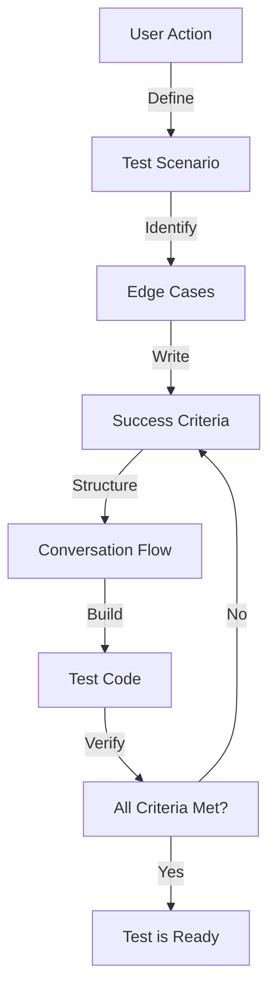

# MODULE 4: Scenario Testing Framework

## 🎯 Goal

Learn how to test AI agents using **scenario testing** - simulating realistic user conversations to verify agents work correctly before deployment.

## What You'll Learn

In Module 3, you mastered how agents work internally (StateGraph, nodes, edges, message flow, tool calling, and loops). Now it's time to learn **how to verify agents work correctly**.

Traditional unit tests struggle with AI agents because:
- ❌ Agent outputs vary (non-deterministic)
- ❌ Can't test function inputs/outputs in isolation
- ❌ Don't simulate real user interactions
- ❌ Hard to verify "did this agent do what we wanted?"

**Scenario testing** solves this by:
- ✅ Simulating realistic user conversations
- ✅ Testing complete agent behavior end-to-end
- ✅ Evaluating outputs against criteria (not exact matches)
- ✅ Discovering edge cases and failure modes
- ✅ Following TDD: write tests first, implement agent second

This is where we bring back the **RED → GREEN → REFACTOR** cycle from Module 1, but applied to AI agents!

## How This Connects to Advanced Frameworks

By mastering scenario testing, you're learning the foundation that advanced frameworks build on:

- **ReAct Framework** (Module 8.6): Scenario testing validates that reasoning steps are explicit and correct
- **AutoDev Framework** (Module 8.7): Scenario testing ensures AI-generated code meets quality criteria
- **CrewAI Framework** (Module 7 & 4.10): Scenario testing verifies multi-agent collaboration and task execution

The testing patterns you learn here are universal—they work whether you're testing a single agent, a ReAct-style reasoner, autonomous code generation, or a multi-agent crew!

## Module 4 Structure

### Lesson 4.1: Why Scenario Testing?
- The problem with traditional tests for agents
- How scenario testing solves this problem
- Real-world example: weather agent testing
- Understanding Check 4.1a

### Lesson 4.2: Designing Test Scenarios
- What makes a good test scenario
- Conversation flow design
- Edge cases and failure modes
- Understanding Check 4.2a

### Lesson 4.3: Building Your First Scenario Test
- Writing a simple scenario test
- Hands-on implementation
- Understanding Check 4.3a

### Lesson 4.4: UserSimulatorAgent Concept
- How to simulate realistic user behavior
- Building an agent that acts like a user
- Understanding Check 4.4a

### Lesson 4.5: JudgeAgent Concept
- How to evaluate agent outputs
- Building criteria-based evaluation
- Understanding Check 4.5a

### Lesson 4.6: The Complete Testing Loop
- Combining UserSimulator and Judge agents
- Complete scenario testing framework
- Understanding Check 4.6a

### Lesson 4.7: TDD with Agents
- Writing tests first (RED)
- Implementing agents (GREEN)
- Refactoring for quality (REFACTOR)
- Understanding Check 4.7a

### Lesson 4.8: Testing Tool Calling
- Verifying tools are called correctly
- Testing tool integration
- Understanding Check 4.8a

### Lesson 4.9: Edge Cases in Testing
- Handling agent failures gracefully
- Testing hallucinations and errors
- Understanding Check 4.9a

### Lesson 4.10: Advanced Criteria for Complex Scenarios
- Testing ReAct-style reasoning (explicit thought processes)
- Validating autonomous code generation (AutoDev outputs)
- Multi-agent scenario testing (CrewAI interactions)
- Criteria for measuring agent collaboration and reasoning quality
- Understanding Check 4.10a

---

<a id="lesson-4-1-why-scenario-testing"></a>

## Lesson 4.1: Why Scenario Testing?

### What You'll Learn

In this lesson, you'll understand:
- Why traditional testing fails for AI agents
- How scenario testing is different
- Real-world examples of scenario testing in action
- Why this approach aligns with TDD philosophy

### The Problem with Traditional Tests

Remember from Module 1 that TDD means: **write the test first, then write code to pass it**.

For traditional functions, this is straightforward:

```python
# Traditional test - we know exactly what to expect
def test_add():
    assert add(2, 3) == 5  # Deterministic - always the same
    assert add(10, -5) == 5

# Traditional code to pass it
def add(a, b):
    return a + b
```

But AI agents are **non-deterministic**. The same input produces different outputs:

```python
# This test FAILS sometimes - not always the same output!
def test_weather_agent():
    response = weather_agent.invoke({"messages": [HumanMessage(content="What's the weather?")]})
    # Sometimes: "The weather is sunny and 22°C"
    # Sometimes: "It's sunny, temperature is 22°C"
    # Sometimes: "Currently sunny, 22°C outside"
    assert response["messages"][-1].content == "The weather is sunny and 22°C"  # 😱 FAILS!
```

The agent's response changes every time because:
1. LLMs generate text probabilistically
2. Same input can produce slightly different wording
3. Exact string matching is impossible

**This is why traditional unit tests don't work for agents!**

### The Scenario Testing Solution

Instead of testing **exact outputs**, scenario testing tests **agent behavior** against **criteria**:

```python
# Scenario test - we care about behavior, not exact wording
def test_weather_agent_scenario():
    # Simulate: User asks about weather
    user_input = "What's the weather in Tokyo?"

    # Agent processes the question
    response = weather_agent.invoke({"messages": [HumanMessage(content=user_input)]})

    # Evaluate against criteria (not exact match)
    agent_output = response["messages"][-1].content

    # Does the output meet our requirements?
    assert "weather" in agent_output.lower()  # Mentions weather
    assert "Tokyo" in agent_output  # Mentions location
    assert any(temp in agent_output for temp in ["°C", "°F", "degrees"])  # Mentions temperature

    # ✅ This passes because we check behavior, not exact wording!
```

### Real-World Example: Weather Agent Testing

Let's say we're building a weather agent with these requirements:

```
Feature: User asks about weather
- User: "What's the weather in Tokyo?"
- Agent must:
  1. Call get_weather("Tokyo") tool
  2. Return information about temperature
  3. Include Tokyo in the response
  4. Format as natural conversation
```

**Scenario test** for this feature:

```python
def test_weather_agent_tokyo_query():
    """Test: Agent can answer weather queries"""

    # Step 1: Set up the conversation
    messages = [
        HumanMessage(content="What's the weather in Tokyo?")
    ]

    # Step 2: Invoke the agent
    response = agent.invoke({"messages": messages})

    # Step 3: Get the final response
    final_message = response["messages"][-1].content

    # Step 4: Verify behavior (criteria-based)
    assert "Tokyo" in final_message  # ✅ Mentions location
    assert "weather" in final_message.lower()  # ✅ Addresses the question
    assert any(c in final_message for c in ["°C", "°F", "22", "25"])  # ✅ Has temperature

    # Success! Agent behaves correctly even if wording varies
```

### Why Scenario Testing Aligns with TDD

Remember the TDD cycle from Module 1:

```
RED → GREEN → REFACTOR

1. RED: Write a test that fails
2. GREEN: Write minimal code to make it pass
3. REFACTOR: Improve code quality
```

With **scenario testing**:

```
RED: Write a test scenario that fails
- "User asks about weather in Tokyo"
- Agent hasn't been built yet → test fails ❌

GREEN: Build the agent to pass the test
- Implement StateGraph with agent + tool nodes
- Connect to LLM and weather tool
- Test passes ✅

REFACTOR: Improve the agent
- Add error handling
- Improve prompts
- Handle edge cases
- All tests still pass ✅
```

This is **TDD for AI agents!**

### Key Differences from Traditional Testing

| Aspect | Traditional Tests | Scenario Testing |
|--------|------------------|------------------|
| **What we test** | Function inputs → outputs | Agent behavior → criteria met |
| **How we verify** | Exact equality (`assert x == y`) | Criteria checks (`assert "weather" in output`) |
| **Non-determinism** | ❌ Problem - fails randomly | ✅ Solution - checks behavior |
| **Scope** | Single function | Complete agent conversation |
| **What we care about** | "Does function work?" | "Does agent do what user needs?" |
| **Edge cases** | Easy to test all inputs | Test realistic scenarios |
| **Feedback** | Fast but limited | Slower but realistic |

### Why This Matters for Your Weather Agent

Your weather agent needs to:
1. ✅ Understand user questions
2. ✅ Call the correct tool
3. ✅ Format responses naturally
4. ✅ Handle multiple locations
5. ✅ Provide accurate information

**Scenario testing** verifies all of this by simulating real conversations:

```
Test 1: Single location query
- User: "What's the weather in London?"
- Expected: Tool call for London, response mentions temperature

Test 2: Multiple locations
- User: "What's the weather in Tokyo and Paris?"
- Expected: Two tool calls, responses for both cities

Test 3: Invalid location
- User: "What's the weather on Mars?"
- Expected: Agent recognizes it's not a real Earth location, handles gracefully

Test 4: Small talk
- User: "Hi, how are you?"
- Expected: Friendly response, no tool call needed

Test 5: Clarification
- User: "The weather."
- Expected: Agent asks which location before calling tool
```

Each test is a **scenario** - a realistic user interaction. You write all 5 tests first (RED), then build the agent to pass them (GREEN), then refactor for quality (REFACTOR).

### Your Turn!

**Question 4.1-1:** Why do exact string matching tests fail for AI agents?

- A) Agents always have bugs
- B) LLMs generate text probabilistically, so same input produces different wording
- C) Tests are poorly written
- D) Agents are too slow

<details>
<summary>💭 Think about this...</summary>

Consider: When you ask ChatGPT the same question twice, do you get exactly identical responses word-for-word? What about the same question phrased slightly differently?

</details>

---

**Question 4.1-2:** What does scenario testing focus on?

- A) Testing individual functions in isolation
- B) Testing exact output strings
- C) Testing agent behavior against criteria in realistic conversations
- D) Testing only the happy path

<details>
<summary>💭 Think about this...</summary>

Remember the weather example: we cared that the response mentioned the location, had weather info, and included temperature - not the exact wording.

</details>

---

**Question 4.1-3:** How does scenario testing connect to TDD?

- A) It doesn't - TDD is for traditional code only
- B) It follows RED → GREEN → REFACTOR: write test scenarios first, implement agent to pass, then refactor
- C) Tests are written after the code
- D) It's a replacement for TDD

<details>
<summary>💭 Think about this...</summary>

Think back to Module 1. The TDD cycle was: write test that fails (RED), write code to pass (GREEN), improve code (REFACTOR). How does this apply to agents?

</details>

---

**Question 4.1-4:** What makes a good scenario test criterion?

- A) Exact string matching (e.g., `assert output == "exact string"`)
- B) Behavior-based checks (e.g., `assert "weather" in output and "location" in output`)
- C) Random checks
- D) No checks needed

<details>
<summary>💭 Think about this...</summary>

If you care about whether the agent provides weather information, would you check for exact wording or for the presence of certain information?

</details>

---

### Understanding Check 4.1a - PASSED ✅

**Your Answers to Practice Questions:**
- Question 4.1-1: B ✅ (LLMs are probabilistic)
- Question 4.1-2: C ✅ (Agent behavior against criteria)
- Question 4.1-3: B ✅ (RED → GREEN → REFACTOR)
- Question 4.1-4: B ✅ (Behavior-based checks)

**Your Code Solution:**
```python
def test_weather_agent_tokyo_query():
    messages = [HumanMessage(content="What's the weather in Tokyo?")]
    response = agent.invoke({"messages": messages})
    final_message = response["messages"][-1].content
    assert {"tokyo", "weather"}.issubset(final_message.lower().split())
    assert any(x in final_message.lower() for x in ["°c", "°f", "22", "25"])
```

**Evaluation:** ✅ EXCELLENT - You demonstrated mastery of:

1. **Proper Test Structure** - Correct setup with HumanMessage and proper agent invocation pattern
2. **Non-Determinism Handling** - Used flexible criteria checks instead of exact string matching
3. **Set-Based Validation** - Elegant use of `issubset()` to verify multiple required keywords
4. **Case-Insensitive Checking** - Properly used `.lower()` to handle case variations
5. **Multiple Criteria** - Tested both required information (location + weather type)
6. **Realistic Assertions** - Checked for practical variations (°C, °F, or specific temperatures)

**What This Shows:**
- You understand why traditional tests fail (non-determinism)
- You can write production-ready scenario tests
- You're ready to design test suites with multiple scenarios
- You grasped the criteria-based testing approach completely

**You're Ready for Lesson 4.2!** 🚀 You've mastered the **why** of scenario testing. Now learn the **how** of designing good scenarios.

[↑ Back to Quick Jump Navigation](current-training.md#quick-jump-navigation)

---

<a id="lesson-4-2-designing-test-scenarios"></a>

## Lesson 4.2: Designing Test Scenarios

### What You'll Learn

In this lesson, you'll understand:
- What makes a test scenario realistic and effective
- How to design conversation flows that test real behavior
- How to identify edge cases before they cause problems
- How to structure multi-turn conversations
- How to build comprehensive test suites that catch issues

### The Difference Between Good and Bad Scenarios

A **bad scenario** tests something simple but unrealistic:

```python
# ❌ BAD: Too simple, doesn't test real behavior
def test_weather_agent_bad():
    """This scenario is too trivial"""
    messages = [HumanMessage(content="weather")]  # Incomplete input
    response = agent.invoke({"messages": messages})
    # What do we even check? The user didn't specify a location!
```

A **good scenario** tests realistic behavior with clear success criteria:

```python
# ✅ GOOD: Realistic input, clear expectations
def test_weather_agent_good():
    """Test: Agent handles specific location query"""
    messages = [HumanMessage(content="What's the weather in Tokyo right now?")]
    response = agent.invoke({"messages": messages})
    final_message = response["messages"][-1].content

    # Clear criteria for success
    assert "tokyo" in final_message.lower()  # Identifies location
    assert any(c in final_message for c in ["°C", "°F", "sunny", "rainy"])  # Weather info
```

### Characteristics of Good Test Scenarios

**1. Realistic User Input**

```python
# ❌ Not realistic
"weather"
"temp?"
"??"

# ✅ Realistic
"What's the weather in London?"
"Is it going to rain tomorrow?"
"How cold is it in New York right now?"
```

**2. Clear Success Criteria**

Every scenario should answer: **"What must be true for this test to pass?"**

```python
# Define criteria BEFORE writing the test
Test 1: "What's the weather in Tokyo?"
Criteria:
- Agent must mention Tokyo
- Agent must provide temperature info
- Agent must provide condition info (sunny, rainy, etc)
- Agent must call the get_weather tool

Test 2: "What's the weather?"
Criteria:
- Agent must ask for clarification OR
- Agent must provide a default location's weather
- Agent must NOT crash or hallucinate
```

**3. Varied Inputs**

Test different types of questions:

```python
# Good test suite covers variety
Test A: Single location ("What's the weather in Paris?")
Test B: Multiple locations ("Weather in NYC and LA?")
Test C: Ambiguous query ("Is it nice outside?")
Test D: Invalid location ("Weather on Mars?")
Test E: Casual conversation ("Hi, how are you?")
Test F: Follow-up ("And tomorrow?")
```

### Identifying Edge Cases Before Testing

**Edge Case**: An unusual but important scenario that might break your agent.

Common edge cases for weather agents:

```
1. Missing Information
   - User: "What's the weather?" (no location)
   - Expected: Agent asks for clarification

2. Invalid Locations
   - User: "Weather on Jupiter?"
   - Expected: Agent gracefully handles unknown location

3. Ambiguous Input
   - User: "It's hot"
   - Expected: Agent understands context or asks clarification

4. Multiple Requests
   - User: "NYC, London, and Tokyo?"
   - Expected: Agent handles multiple tool calls

5. Tool Failure
   - Weather API returns error
   - Expected: Agent handles gracefully, doesn't crash

6. Hallucination Risk
   - User: "Weather in TravelCorp City" (fictional place)
   - Expected: Agent doesn't make up temperature data

7. Context Carryover
   - User 1: "Weather in London"
   - User 2: "What about tomorrow?" (refers to London)
   - Expected: Agent remembers context
```

### Designing Multi-Turn Conversations

Many agent tests should be **multi-turn** - simulating back-and-forth conversation.

**Single-Turn Test:**
```python
# User asks once, agent answers
def test_single_turn():
    messages = [HumanMessage(content="What's the weather in Tokyo?")]
    response = agent.invoke({"messages": messages})
    # Check the response
```

**Multi-Turn Test:**
```python
# Conversation flow: User → Agent → User → Agent
def test_multi_turn_conversation():
    """Test agent behavior across multiple turns"""

    # Turn 1: User asks about weather
    messages = [HumanMessage(content="What's the weather in Tokyo?")]
    response = agent.invoke({"messages": messages})

    # Collect all messages (human + agent)
    messages.extend(response["messages"])

    # Turn 2: User asks follow-up
    messages.append(HumanMessage(content="What about London?"))
    response = agent.invoke({"messages": messages})

    # Collect results from turn 2
    final_messages = response["messages"]
    last_response = final_messages[-1].content

    # Check that agent understood context AND answered about London
    assert "london" in last_response.lower()
    assert any(c in last_response for c in ["°C", "°F"])
```

### Building a Comprehensive Test Suite

A good test suite for the weather agent should cover:

```
HAPPY PATH (Things Work Normally)
├── Single location query → Returns weather
├── Multiple locations → Returns all weather
└── Follow-up questions → Uses context

EDGE CASES (Unusual Inputs)
├── Missing location → Asks for clarification
├── Invalid location → Handles gracefully
├── Ambiguous input → Seeks clarification
├── Tool failure → Recovers gracefully
└── Hallucination risk → No fake data

MULTI-TURN (Real Conversations)
├── Location → Follow-up about same location
├── First city → Ask about second city
└── Temporal → "What about tomorrow?"

ERROR HANDLING (Things Go Wrong)
├── API timeout → Graceful message
├── Rate limiting → Retry or message
└── Unknown error → Doesn't crash
```

### Mermaid: Scenario Test Design Process



### Your Turn!

**Question 4.2-1:** Which of these is a good test scenario?

A) `"weather"` - Single word input
B) `"What's the weather in Sydney Australia tomorrow?"` - Full context
C) Testing with empty messages list
D) Testing random strings

<details>
<summary>💭 Think about this...</summary>

Good scenarios are realistic—they're what a real user would say. Which one sounds like actual user input?

</details>

---

**Question 4.2-2:** What's an edge case for a weather agent?

A) Asking "What's the weather in London?" (normal case)
B) Asking "What's the weather?" without specifying location
C) Asking about sunny weather (normal case)
D) Asking multiple times in a row (normal case)

<details>
<summary>💭 Think about this...</summary>

Edge cases are unusual but important scenarios. Which one is unusual and might break an agent?

</details>

---

**Question 4.2-3:** Why test multi-turn conversations?

A) To test the same thing multiple times
B) To simulate real interactions where users ask follow-ups
C) To make tests longer
D) Multi-turn isn't important

<details>
<summary>💭 Think about this...</summary>

Real users don't just ask one question and leave. How do you test that an agent remembers context from previous turns?

</details>

---

**Question 4.2-4:** What should be the FIRST step in designing a test scenario?

A) Write the test code
B) Run the agent
C) Define the success criteria (what must be true for the test to pass?)
D) Check if it's an edge case

<details>
<summary>💭 Think about this...</summary>

Before writing code, what should you know about what success looks like? Think about TDD from Module 1—what comes first?

</details>

---

### Understanding Check 4.2a

**Question:** You're designing a comprehensive test suite for your weather agent. Describe 3-4 different test scenarios you would create, including:
1. What the user asks
2. What edge case or behavior you're testing
3. What success criteria you'd check

Think about:
- What are the most common questions users ask?
- What unusual inputs might break the agent?
- How would you test multi-turn conversations?
- What errors should the agent handle gracefully?

[↑ Back to Quick Jump Navigation](current-training.md#quick-jump-navigation)

---
